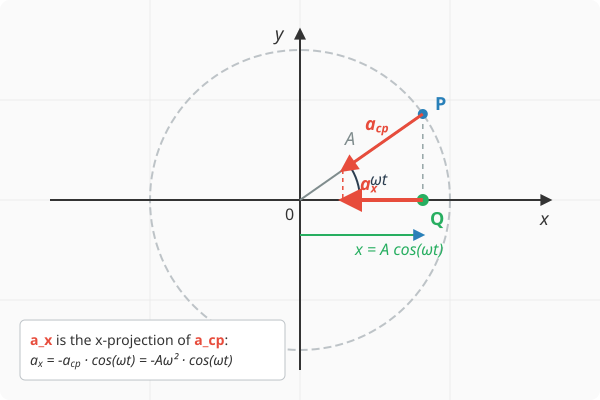

# Hooke's Law

## Acceleration of Simple Harmonic Motion

We are now interested in the acceleration of an object performing simple harmonic motion. Without advanced mathematical knowledge, we can determine this in exactly the same way as we did for velocity. Let the displacement of the body follow our usual expression:

$$
x = A\cos(\omega t)
$$

The object moves along a straight line parallel to the x-axis, and determining its acceleration is not straightforward because the velocity is continuously changing, just like the acceleration itself. Fortunately, since the object moves in perfect synchronization with a corresponding body undergoing uniform circular motion—whose acceleration we know at every instant—the acceleration can still be determined. It is clearly identical to the x-component of the acceleration of the object performing circular motion. This can be proven in exactly the same way as we did for velocity in the previous lesson:

$$
\overline{a}_x = \frac{v_x - v_{x,0}}{t}
$$

This relationship for average acceleration holds true for any time interval $t$. Although average acceleration does not necessarily equal instantaneous acceleration, they become equal within measurement precision if the time interval $t$ is chosen to be sufficiently short. Therefore, in the case where $t \to 0$, we obtain the instantaneous acceleration, which equals the x-component of the acceleration of the body performing circular motion, since this equivalence also holds for the velocity component $v_x$.

The magnitude of the acceleration of an object performing uniform circular motion is $a = \frac{v^2}{r} = r\omega^2$. Applying the relationship $r = A$, we obtain the following expression for the x-component:

$$
a_x = -A\omega^2\cos(\omega t)
$$

### Example
The displacement-time function of a body performing simple harmonic motion is given by:

$$
x = 0.2\cos(4\pi t)
$$

where $x$ is in metres (m) and $t$ is in seconds (s). Determine the following quantities:

* Amplitude
* Angular frequency
* Acceleration as a function of time
* Value of acceleration at $t = 0.1\text{ s}$
* Maximum value of acceleration

The following data can be read directly from the displacement-time function:

$$
A = 0.2\text{ m}
$$

$$
\omega = 4\pi \text{ rad/s}
$$

Based on this, we can write the expression for $a_x$ as a function of time $t$:

$$
a_x = -A\omega^2 \cos(\omega t) = -0.2 \cdot (4\pi)^2 \cos (4\pi t) = -31.58\cos(12.566 t)
$$

*(Note: The sign of the acceleration in the equation is negative, though we often use the absolute value when computing its magnitude. To determine the maximum value, we take the amplitude of the acceleration function.)*

From here, the acceleration at the time instant $t = 0.1\text{ s}$ can be calculated, and the maximum value of the acceleration can be read:

$$
a_x = -31.58\cos(12.566 \cdot 0.1) = -9.760\text{ m/s}^2
$$

$$
a_{x,\max} = 31.58\text{ m/s}^2
$$

## Dynamical Condition for Simple Harmonic Motion

The displacement can be substituted back into the formula for calculating acceleration, which brings us to the following equation:

$$
a_x = -\omega^2A\cos(\omega t) = -\omega^2x
$$

The acceleration of simple harmonic motion is directly proportional to the displacement but points in the opposite direction. The proportionality constant is the square of the angular frequency.
According to Newton's second law, this implies that the net force is also proportional to the displacement and acts in the opposite direction:

$$
F_{x,\text{e}} = ma_x = -m\omega^2x
$$

>**The dynamical condition for simple harmonic motion is a restoring force that is directly proportional to the displacement but points in the opposite direction, pulling the object back toward its equilibrium position.**

## Hooke's Law

>**The elastic restoring force is directly proportional to the elongation but points in the opposite direction. The proportionality constant is the spring constant. It is denoted by $D$ and its unit is N/m.**

$$
F_x = -Dx
$$

### Experiment

[Demonstration of Hooke's Law by Walter Lewin](https://www.youtube.com/shorts/PaIE7eTPzJA)

### Simulation

[The Weight](https://alexerdei73.github.io/physics-engine/project/#38c6b933-5bd4-42f2-a59e-1390633a14a3)

The simulation is also suitable for demonstrating Hooke's law. Log out of the application if you are logged in, and then in the **Create** menu, you can double the mass of body 3. Do not forget to click the **Save** button! Restarting the simulation in the **Project** menu with the **Start** button will cause the body on the spring to begin simple harmonic motion, with its equilibrium position located at $y = 3\text{ m}$. If you also set the initial y-position of body 3 to 3 m, no oscillation will occur, and the body will remain in equilibrium. If you increase the mass to three times its original value instead of doubling it, the equilibrium position shifts to $y = 4\text{ m}$, and so on.

## Period of Simple Harmonic Motion

We substitute Hooke's law for the elastic force into the dynamical condition of simple harmonic motion:

$$
F_x = -m\omega^2x = -Dx
$$

$$
m\omega^2 = D
$$

$$
\omega^2 = \frac{D}{m}
$$

Now we utilize the relationship $\omega = \frac{2\pi}{T}$:

$$
\left(\frac{2\pi}{T}\right)^2 = \frac{D}{m}
$$

Taking the reciprocal of both sides:

$$
\left(\frac{T}{2\pi}\right)^2 = \frac{m}{D}
$$

Taking the square root:

$$
\frac{T}{2\pi} = \sqrt{\frac{m}{D}}
$$

Finally, multiplying by $2\pi$:

$$
T = 2\pi \sqrt{\frac{m}{D}}
$$

### Example
A body with a mass of $100\text{ g}$ is suspended from a spring of negligible mass. The other end of the spring is fixed so that the body can oscillate vertically. The body is lifted above its equilibrium position to a height where the spring is unstretched and then released. The spring constant is $100\text{ N/m}$.

* What is the amplitude of the resulting oscillation?
* What is the angular frequency?
* What is the period?
* Write down the displacement-time function if the x-axis points vertically upward and the origin is located at the equilibrium position!
* When does the body pass through the equilibrium position for the first time after release?
* What is its velocity at the moment it passes through?

At equilibrium, the gravitational force balances the spring force:

$$
-mg + (-Dx) = 0
$$

$$
-0.1 \cdot 9.81 - 100x = 0
$$

$$
-0.981 = 100x
$$

$$
x = -0.00981\text{ m}
$$

Thus, the extension of the spring at equilibrium is approximately $1\text{ cm}$. Moving forward, we place the origin at the equilibrium position, meaning $x = 0$ at equilibrium, and $0.00981\text{ m}$ is the position from which the oscillation is initiated.

$$
A = 0.00981\text{ m}
$$

$$
\omega = \sqrt{\frac{D}{m}} = \sqrt{\frac{100}{0.1}} = 31.62\text{ rad/s}
$$

$$
\omega = \frac{2\pi}{T}
$$

$$
T = \frac{2\pi}{\omega} = \frac{6.283}{31.62} = 0.1987\text{ s}
$$

The displacement-time function can be easily written since the body starts from position $x = +A$:

$$
x = A\cos(\omega t) = 0.00981\cos(31.62t)
$$

The body passes through the equilibrium position when $x = 0$, so:

$$
0 = 0.00981\cos(31.62t)
$$

This yields (when the argument of the cosine function is $\pi/2 \approx 1.571$):

$$
1.571 = 31.62t
$$

$$
t = \frac{1.571}{31.62} = 0.04968\text{ s} = \frac{T}{4}
$$

Therefore, the body passes through the origin—the equilibrium position—for the first time upon completing its first quarter period. At this moment, its velocity is:

$$
v_x = -A\omega \sin(\omega t) = -0.00981 \cdot 31.62 \sin(31.62 \cdot 0.04968) = -0.3102\text{ m/s}
$$

The velocity reaches its maximum magnitude when passing through the equilibrium position, since the value of the sine function is either $1$ or $-1$. Upon the first crossing, the value of the sine function is $+1$, which means the velocity points in the negative direction.

---

## Problems

1. A weight with a mass of $400\text{ g}$ is suspended from a vertically fixed spring of negligible mass. As a result, the spring stretches by $8\text{ cm}$ before reaching its new equilibrium position. Determine the spring constant! ($g = 9,81\text{ m/s}^2$)

2. A cart with a mass of $0.6\text{ kg}$ is attached to a horizontal spring with a spring constant of $D = 150\text{ N/m}$. Friction is negligible. The system is displaced from its equilibrium position and released. Calculate the angular frequency and period of the resulting simple harmonic motion!

3. The displacement-time function of a body performing simple harmonic motion is: $x(t) = 0.05\cos(10\pi t)$, where $x$ is measured in metres and $t$ in seconds. Determine the maximum velocity and maximum acceleration of the body!

4. The period of a body hanging from a spring is $1.2\text{ s}$. What will the period of oscillation be if the original body is removed and an object with four times its mass is attached to the spring instead?

5. A body with a mass of $0.5\text{ kg}$ performing simple harmonic motion has an amplitude of $12\text{ cm}$ and an oscillation frequency of $2\text{ Hz}$. What is the maximum restoring force (net force) acting on the body, and at which point along its path does this force occur?