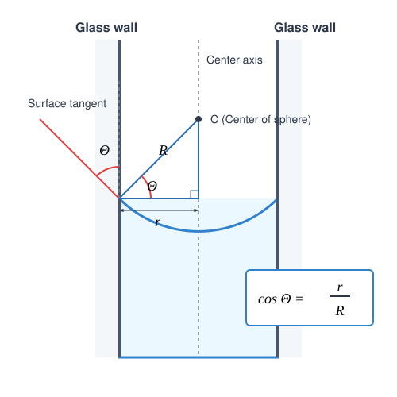

# Capillary Pressure

## Experiments

[Sas Elemér's experiments on surface tension](https://www.youtube.com/watch?v=Yg0TPid2Yt4&t=14m06s)

In the experiments, we observe that fluid surfaces curve near the walls of a container. A wetting fluid climbs up the wall of the container, while a non-wetting fluid stands lower at the wall compared to its level far away from the wall. 

In capillary tubes, the shape of the fluid interface can be considered spherical to a good approximation. The curved fluid surface exerts pressure on the fluid or gas at the boundary. This pressure is always directed toward the center of the concave surface. This causes a wetting fluid to rise higher inside a capillary tube than outside it, while the opposite occurs for a non-wetting fluid. Similarly, this pressure attempts to compress the air inside a bubble, which is why a bubble must be blown to grow—meaning an overpressure must be exerted on the internal air relative to the external atmospheric pressure.

## Capillary Pressure

> **The additional pressure exerted by curved fluid surfaces is called capillary or curvature pressure (Laplace pressure), which always results in a net force pointing toward the concave side of the fluid.**

### Volumetric Work
Let us examine how much work is done on a gas when its volume is changed by $\Delta V$ at a constant pressure $p$. Suppose the gas is inside a cylinder with a base area $A$, sealed by a piston. Move the piston inward toward the interior of the cylinder by a small distance $s$. In this case, the work done (provided the piston does not accelerate) is:

$$
W = F \cdot s = p \cdot A \cdot s = -p \cdot \Delta V
$$

This is the work done *by us on the gas*, which decreases the volume of the gas, so we examined the case where $\Delta V < 0$ (the work done *by the gas* would be the opposite).

### Calculation of Capillary Pressure
For the sake of simplicity, we derived our formula for volumetric work using a cylindrical container, but it applies to a body of any shape if the pressure can be considered constant during the process. We will now apply this to a spherical soap bubble. 

Imagine blowing a small amount of air into a bubble such that the internal pressure can be considered approximately constant. In this case, we perform work, but this work increases the internal energy of the air by a negligible amount; it is spent almost entirely on increasing the surface energy of the bubble. Since the soap film bounding the bubble has both an outer and an inner surface, the film possesses two interfaces.

The volumetric work performed by us during the expansion of the bubble is:

$$
W = 2p_g \cdot \Delta V
$$

Here, $p_g$ is half of the curvature overpressure ruling inside the bubble, and $\Delta V$ is the increase in the bubble's volume. If the change in radius ($\Delta R$) is very small compared to the original radius $R$, the change in volume can be written as the product of the sphere's surface area and the change in radius:

$$
\Delta V = 4\pi R^2 \cdot \Delta R
$$

Let us look at how the surface area of the bubble changes. For this, we will need the change in the square of the radius ($\Delta R^2$):

$$
\Delta R^2 = R^2 - R_0^2 = (R + R_0)(R - R_0) = (2R - \Delta R)\Delta R \approx 2R \cdot \Delta R
$$

In the final step, the small $\Delta R$ was neglected next to the significantly larger $2R$.

Let us examine the increase in surface area energy, taking into account both surfaces (outer and inner):

$$
E_{\text{surface}} = \alpha \cdot 2A = \alpha \cdot 2 \cdot (4\pi R^2) = \alpha \cdot 8\pi R^2
$$

$$
\Delta E_{\text{surface}} = \alpha \cdot 8\pi R^2 - \alpha \cdot 8\pi R_0^2 = \alpha \cdot 8\pi (R^2 - R_0^2) = \alpha \cdot 8\pi \Delta R^2
$$

Substituting the earlier approximation ($\Delta R^2 \approx 2R \cdot \Delta R$):

$$
\Delta E_{\text{surface}} = \alpha \cdot 8\pi \cdot (2R \cdot \Delta R) = \alpha \cdot 16\pi R \cdot \Delta R
$$

The volumetric work performed is entirely spent on increasing the surface energy:

$$
W = \Delta E_{\text{surface}}
$$

$$
2p_g \cdot 4\pi R^2 \cdot \Delta R = \alpha \cdot 16\pi R \cdot \Delta R
$$

After simplification, the curvature pressure can be expressed as:

$$
p_g = \frac{2\alpha}{R}
$$

### Example 1
The radius of a soap bubble is $3\text{ cm} = 0.03\text{ m}$, and the surface tension of the solution is $\alpha = 0.03\text{ N/m}$. By how much is the air pressure inside the bubble greater than the external atmospheric pressure?

$$
p = 2p_g = \frac{4\alpha}{R} = \frac{4 \cdot 0.03\text{ N/m}}{0.03\text{ m}} = 4\text{ Pa}
$$

The overpressure inside the bubble is a mere $4\text{ Pa}$.

---

## Fluid Rise in a Capillary Tube

Next, we calculate how high a fluid rises inside a capillary tube. In very thin tubes, the shape of the fluid surface can be considered a spherical cap to a good approximation, whereas in thick tubes, most of the surface is a horizontal plane, except in the immediate vicinity of the tube wall. The following line of reasoning applies specifically to thin capillaries.

According to the law of communicating vessels, the pressure at the level of the free surface outside the tube must equal the pressure inside the tube at the same height.

$$
p_0 = p_0 + \rho g h - p_g
$$

The curvature pressure $p_g$ is subtracted here because we assume that the surface is concave (wetting fluid), which creates a pressure drop in the fluid in the immediate vicinity of the meniscus, drawing the column upward.

Let the contact (wetting) angle formed by the tangent to the fluid surface and the tube wall be $\theta$. This angle is less than $90^\circ$ for wetting fluids and greater than $90^\circ$ for non-wetting fluids. For very clean glass and pure water, this angle is approximately $0^\circ$.

Based on the geometric arrangement, the relationship between the radius of the tube $r$ and the radius of the meniscus's spherical surface $R$ is:

$$
\cos\theta = \frac{r}{R} \implies R = \frac{r}{\cos\theta}
$$

Thus, the curvature pressure exerted by the meniscus, which has only a single interface, is:

$$
p_g = \frac{2\alpha}{R} = \frac{2\alpha\cos\theta}{r}
$$

Substituting this into our hydrostatic equilibrium equation:

$$
p_0 = p_0 + \rho g h - \frac{2\alpha\cos\theta}{r}
$$

Rearranging the terms, the height $h$ of the fluid column can be expressed as:

$$
h = \frac{2\alpha\cos\theta}{\rho g r}
$$

### Example 2
How many millimetres does mercury depress inside a capillary tube with a radius of $r = 0.1\text{ mm} = 0.0001\text{ m}$? The surface tension of mercury is $\alpha = 0.4865\text{ N/m}$, its density is $\rho = 13,600\text{ kg/m}^3$, and its contact angle is $\theta = 140^\circ$. ($g \approx 9.81\text{ m/s}^2$)

$$
h = \frac{2\alpha\cos\theta}{\rho g r} = \frac{2 \cdot 0.4865\text{ N/m} \cdot \cos(140^\circ)}{13,600\text{ kg/m}^3 \cdot 9.81\text{ m/s}^2 \cdot 0.0001\text{ m}}
$$

$$
h \approx \frac{0.973 \cdot (-0.7660)}{13.3416} = \frac{-0.7453}{13.3416} \approx -0.05587\text{ m} \approx -55,9\text{ mm}
$$

The level of mercury inside the tube depresses by approximately $5.6\text{ cm}$ ($55.9\text{ mm}$).

---

## Problems

**Problem 1**
A glass capillary tube with an internal diameter of $d = 0.6\text{ mm}$ is dipped vertically into a container filled with pure water. How high does the water climb inside the capillary if the water perfectly wets the glass ($\theta = 0^\circ$)? The surface tension of water is $\alpha = 0.072\text{ N/m}$, its density is $\rho = 1000\text{ kg/m}^3$, and the acceleration due to gravity is $g \approx 9.81\text{ m/s}^2$.

**Problem 2**
Two soap bubbles of different sizes are blown from the same soap solution ($\alpha = 0.028\text{ N/m}$). The diameter of the first bubble is $4\text{ cm}$, and the internal overpressure inside the second bubble is exactly half of the value measured in the first one. What is the radius of the second soap bubble?

**Problem 3**
Inside a capillary tube dipped into a fluid, the height of the capillary rise is exactly $h = 3\text{ cm}$. In another tube made of the same material but with half the internal radius, the height of the rise is found to be $h = 6\text{ cm}$. If the density of the fluid is $\rho = 800\text{ kg/m}^3$, the radius of the first tube is $r = 0.4\text{ mm}$, and the contact angle due to the clean surfaces is $\theta = 0^\circ$, what is the surface tension of the fluid under investigation?