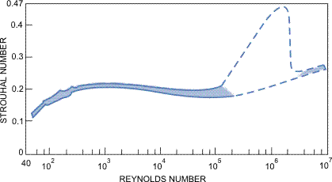

# The Path to Turbulence via the Kármán Vortex Street

## Planar Fluid Flow Around an Infinite Cylinder

### Experiments

[Planar Fluid Flow Around an Infinite Cylinder](https://www.youtube.com/watch?v=6xVF6qJmOnI)

In the previous chapter, we observed laminar flow, which represents a time-independent, vortex-free flow at low Reynolds numbers. In these simple cases—such as fluid flow around a sphere or flow inside an infinitely long, straight pipe—the flow pattern can be theoretically calculated by solving the Navier–Stokes equations, provided one is already familiar with the necessary mathematical framework.

However, we also know that the laws derived this way, such as Stokes' law or the Hagen–Poiseuille law, are only valid approximations for low Reynolds numbers. As soon as the flow becomes sufficiently fast—meaning the Reynolds number grows large enough—internal friction can no longer stabilize the flow. Consequently, vortices appear in the flow and shed from obstacles, such as the pipe wall or the sphere.

By further increasing the Reynolds number, the flow becomes completely turbulent. This is a chaotic state that we will discuss in detail later. For now, we examine the transition zone more closely through a simpler, two-dimensional flow example: fluid flow around an infinitely long cylinder.

### Appearance of Vortices

As seen in the video, this phenomenon occurs frequently in everyday life, but the equations cannot be solved without using computers. Therefore, the best way to study the phenomenon is how the mathematician does it in the video: analyzing simulation results at various Reynolds numbers. We can then compare these with phenomena observed in nature and conclude that the simulations faithfully replicate reality.

At low Reynolds numbers, the flow pattern is stationary (time-independent), and no vortices can be observed at all. In practice, this means $Re < 5$.

If the Reynolds number—meaning the flow velocity—increases, we find that the flow remains stationary, but two motionless vortices appear symmetrically behind the cylinder. This situation persists up to approximately $Re = 46$. As the Reynolds number increases, these two symmetrically positioned vortices grow, but they still remain symmetrically arranged and motionless.

### Vortex Shedding: The von Kármán Vortex Street

In 1911, Theodore von Kármán proved theoretically that a vortex street—where vortices follow each other periodically at equal distances and are arranged alternately above and below the plane of symmetry such that the vortices above and below have opposite directions of rotation—is a stable structure in a flowing fluid. This is the *von Kármán vortex street*.

In the case of the cylinder, the stationary flow becomes unstable when $Re > 46$. A periodic oscillation (sway) emerges, which internal friction can no longer dampen. The symmetry breaks, and vortices begin to shed periodically and alternately from behind the cylinder's material. This generates a new, dynamically stable flow, which is the von Kármán vortex street.

By further increasing the Reynolds number, the shedding vortices interact with the symmetrically positioned vortices that appeared behind the cylinder at lower Reynolds numbers. Consequently, these inner zones will also start to pulsate, and their positioning will no longer be symmetrical at all.

With a drastic increase in the Reynolds number, the flow behind the cylinder becomes fully turbulent. In reality, however, this is a three-dimensional instability, so two-dimensional computer simulations alone can no longer perfectly replicate it.

---

## Real Flows Around Cylinders: The Strouhal Number

How can we predict how many times per second these vortices will shed depending on the wind speed or the thickness of the pillar? The answer to this question was provided by Czech physicist Vincenz Strouhal (1850–1922), who introduced the third most important dimensionless quantity in fluid mechanics, the *Strouhal number* ($St$):

$$
St = \frac{f \cdot d}{u}
$$

*   $f$: frequency of vortex shedding ($\text{1/s}$ or $\text{Hz}$)
*   $d$: diameter of the obstacle (cylinder) ($\text{m}$)
*   $u$: undisturbed flow velocity ($\text{m/s}$)

### A Strouhal-szám a Reynolds-szám függvényében

If we measure in a laboratory how the Strouhal number changes as a function of the Reynolds number (which characterizes flow velocity here) behind a circular cylinder, we get one of the most famous graphs in fluid mechanics:

The most important theoretical takeaway from this graph for us is that across a very wide range of Reynolds numbers—roughly between $250 < Re < 250\ 000$—the Strouhal number can be considered almost entirely constant, specifically $St \approx 0.21$. This means that the resulting frequency will be directly proportional to the flow velocity across this massive engineering range. Obviously, this linearity no longer holds for smaller Reynolds numbers, and at very low Reynolds numbers, vortices do not shed from the body at all.

It is particularly interesting to see what happens at massive Reynolds numbers. Here, the fluid boundary layer adhering to the cylinder—which maintains its laminar character on the front wall for a long time—also becomes turbulent. This means that the exact geometric location of vortex shedding begins to fluctuate, causing the strictly regular periodic nature and the constant, clean frequency to break down. At even higher Reynolds numbers, this recovers into a more stable state, but there the value of the Strouhal number is higher, moving roughly between $0.25 - 0.30$.

### The Strouhal Number in Practice

Periodically shedding vortices can drive elastic structures into intense vibration, and if mechanical resonance occurs, this can even be life-threatening or destructive. Knowing the Strouhal number and the flow velocity allows the shedding frequency to be calculated, meaning structures can be designed to prevent this resonance from developing.

The infamous **Tacoma Narrows Bridge** collapsed spectacularly in high winds just 4 months after its opening. During post-disaster investigations, it was long suspected that the bridge was destroyed by pure Kármán vortex resonance as outlined above. Theodore von Kármán himself actively participated in the investigations and the aerodynamic design of the new bridge. Based on modern fluid dynamics research, we now know that the frequency of vortex shedding as a function of that day's wind speed was approx. $1\text{ Hz}$, while the fatal torsional (twisting) vibrations that developed on the bridge had a frequency of approx. $0.2\text{ Hz}$. Thus, it was not pure von Kármán vortex street resonance that caused the bridge to collapse (but rather a phenomenon called aeroelastic flutter).

However, the violent swaying of utility poles and thin wires in the wind is caused precisely by this phenomenon. This rhythmic force thrust is also extremely dangerous for tall, cylindrical factory chimneys, which is why spiral strakes (spoiler ridges) are installed on them to break up the rhythm of the vortices.

Furthermore, the Strouhal number is a crucial factor in bird flight and fish swimming. Part of the energy of the shedding vortices can actually be recovered if the animal's movement (wing flap or tail beat) occurs at the correct frequency. According to measurements, the biologically optimal, most energy-efficient value lies precisely in the Strouhal range between $0.2$ and $0.4$.

### Example

What is the Reynolds number, the Strouhal number, and the frequency of the periodic force exerted on the pole by the vortices under a wind speed of $36\text{ km/h}$ blowing around a cylindrical utility pole with a diameter of $30\text{ cm}$?  
The density of air at $20\text{ }^{\circ}\text{C}$ is $\rho = 1.204\text{ kg/m}^3$, and its dynamic viscosity is $\eta = 1.82 \cdot 10^{-5}\text{ Pa}\cdot\text{s}$.

Let's convert the wind speed to SI base units:

$$
u = 36\text{ km/h} = \frac{36\ 000\text{ m}}{3600\text{ s}} = 10\text{ m/s}
$$

The characteristic dimension of the pipe or pole is the diameter: $d = 30\text{ cm} = 0.3\text{ m}$. Let's calculate the global Reynolds number characteristic of the flow:

$$
Re = \frac{\rho d u}{\eta} = \frac{1.204 \cdot 0.3 \cdot 10}{1.82 \cdot 10^{-5}} = 198\ 461
$$

This is a remarkably high Reynolds number, but looking at the St(Re) diagram, it is visible that this value still lies strictly within the stable plateau. Thus, the Strouhal number can be taken as constant:

$$
St \approx 0.21
$$

Let's express the required frequency $f$ from the definition equation of the Strouhal number using pure algebra:

$$
f = \frac{St \cdot u}{d} = \frac{0.21 \cdot 10}{0.3} = 7.0\text{ Hz}
$$

The vortices shedding behind the pole will alternately exert a crosswise tugging force on the structure seven times per second (at a rate of $7\text{ Hz}$).

---

## Exercises

1. In a winter storm, the wind speed is $u = 15\text{ m/s}$. A thin copper transmission line with a diameter of $d = 5\text{ mm}$ ($0.005\text{ m}$) is stretched against the wind. Assuming the flow is on the stable plateau according to the graph, the Strouhal number is $St = 0.21$. At what frequency $f$ (pitch) will the wire whistle in the wind? Is this sound audible to the human ear?

2. At a factory site, a cylindrical metal chimney with a diameter of $d = 2\text{ m}$ was erected. According to structural measurements, the natural resonant frequency of the chimney structure (which deflects it most easily) is $f_{\text{natural}} = 3\text{ Hz}$ (three oscillations per second). The flow operates on the stable plateau ($St = 0.21$). At what wind speed ($u$) does the danger of a resonance disaster occur, i.e., when will the rate of vortex shedding be exactly equal to the chimney's natural frequency? Calculate this critical wind speed in $\text{km/h}$ as well!

3. A bionics research group is studying the swimming of a small shark in a flow channel. The shark's traveling speed in the water is $u = 2\text{ m/s}$. According to measurements, the height of the shark's caudal (tail) fin (which is the characteristic dimension of the obstacle disrupting the flow) is $d = 10\text{ cm}$ ($0.1\text{ m}$). From the analysis of the video recordings, they determine that the shark beats its tail exactly six times per second ($f = 6\text{ Hz}$). Determine the Strouhal number characteristic of the shark's motion! Based on the obtained value, is the animal's movement within the bionically most energy-efficient and optimal zone?