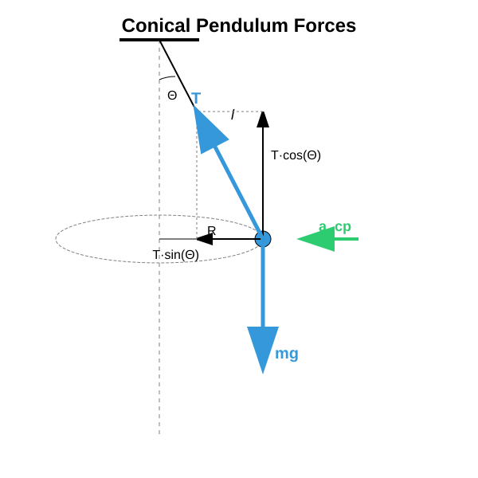
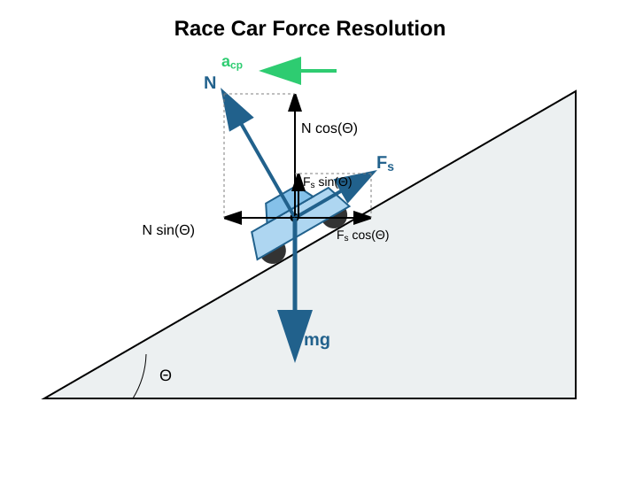

# Further Examples of Circular Motion *

## The Conical Pendulum

### Experiment

[Demonstration of a conical pendulum](https://www.youtube.com/watch?v=1R5jpNTSxDg)

### The Period

A conical pendulum is a pendulum that undergoes uniform circular motion in a horizontal plane, while the string traces out the surface of a cone. The body is acted upon by the vertically downward gravitational force and the tension force acting along the line of the string. The tension force can be decomposed into vertical and horizontal components. The vertical component of the tension balances the gravitational force, since the pendulum does not accelerate vertically. The circular motion takes place in a horizontal plane, meaning that the centripetal acceleration is horizontal and is produced by the horizontal component of the tension force.

$$
T \cos \Theta = mg
$$

$$
T \sin \Theta = ma_{\text{cp}}
$$

$$
a_{\text{cp}} = \frac{v^2}{R}
$$

We express $T$ from the first equation and substitute it into the second equation along with the centripetal acceleration:

$$
T = \frac{mg}{\cos \Theta}
$$

$$
mg \frac{\sin \Theta}{\cos \Theta} = m \frac{v^2}{R}
$$

$$
v^2 = gR \tan \Theta
$$

Now we can use the relation:

$$
v = R\omega
$$

$$
(R\omega)^2 = gR \tan \Theta
$$

$$
R^2 \omega^2 = gR \tan \Theta
$$

$$
\omega^2 = \frac{g \sin \Theta}{R \cos \Theta}
$$

Next, we use:

$$
R = l \sin \Theta
$$

This gives us:

$$
\omega^2 = \frac{g \sin \Theta}{l \sin \Theta \cos \Theta}
$$

$$
\frac{2\pi}{T} = \sqrt{\frac{g}{l \cos \Theta}}
$$

$$
\frac{T}{2\pi} = \sqrt{\frac{l \cos \Theta}{g}}
$$

$$
T = 2\pi \sqrt{\frac{l \cos \Theta}{g}}
$$

This formula represents the period of a conical pendulum. If the angle $\Theta$ is very small compared to $1\text{ rad}$, then the value of $\cos \Theta$ can be taken as $1$, and we recover the formula for the period of a simple pendulum swinging in a vertical plane at small displacements. We will discuss this later. We see, therefore, that the period of a conical pendulum for small cone angles is identical to the period of a simple pendulum at small displacements. This was also demonstrated in the video.

### Example

A body of mass $0.1\text{ kg}$ undergoes uniform circular motion in a horizontal plane on a string of length $1\text{ m}$, while the angle between the string and the vertical is $30^\circ$. What is the radius of the circular path? What is the tension force stretching the string? What is the centripetal force? What is the velocity of the body? What is the period of revolution? Verify the answer using the formula obtained for the period as well!

$$
R = l \sin \Theta = 1\text{ m} \cdot \sin 30^\circ = 0.5\text{ m}
$$

$$
T \cos \Theta = mg
$$

$$
T = \frac{mg}{\cos \Theta} = \frac{0.1 \cdot 9.81}{\cos 30^\circ} \approx 1.133\text{ N}
$$

$$
F_{\text{net}} = T \sin \Theta = 1.133 \cdot \sin 30^\circ \approx 0.5663\text{ N}
$$

$$
F_{\text{net}} = ma
$$

$$
a = \frac{F_{\text{net}}}{m} = \frac{0.5663}{0.1} = 5.663\text{ m/s}^2
$$

$$
a = \frac{v^2}{R}
$$

$$
5.663 = \frac{v^2}{0.5}
$$

$$
2.8315 = v^2
$$

$$
v = \sqrt{2.8315} \approx 1.683\text{ m/s}
$$

$$
v = \frac{2\pi R}{T}
$$

$$
T = \frac{2\pi R}{v} = \frac{2\pi \cdot 0.5}{1.683} \approx 1.867\text{ s}
$$

Let us also calculate it using the formula we derived:

$$
T = 2\pi \sqrt{\frac{l \cos \Theta}{g}} = 2\pi \sqrt{\frac{1 \cdot \cos 30^\circ}{9,81}} \approx 1.867\text{ s}
$$

Evidently, the formula yields exactly the same result as our step-by-step calculation, just as it should.

## Race Car on a Banked Track

### Example

A race car of mass $1200\text{ kg}$ travels at a speed of $108\text{ km/h}$ through a curve with a radius of $150\text{ m}$. The banking angle of the track relative to the horizontal is $30^\circ$. What are the normal constraint force and the static friction force exerted by the track? If $\mu_{\text{s}} = 0.7$, will the car slide out?

The speed of the car is low, so it would slide downwards along the banked track. This is prevented by a static friction force pointing upwards along the plane of the track.

We decompose the static friction force and the normal force into vertical components and horizontal components parallel to the acceleration. This yields:

$$
T \cos \Theta + F_{\text{s}} \sin \Theta - mg = 0
$$

$$
T \sin \Theta - F_{\text{s}} \cos \Theta = ma_{\text{cp}}
$$

$$
a_{\text{cp}} = \frac{v^2}{R}
$$

$$
108\text{ km/h} = 108 \cdot \frac{1000\text{ m}}{3600\text{ s}} = 30\text{ m/s}
$$

$$
a_{\text{cp}} = \frac{v^2}{R} = \frac{30^2}{150} = 6\text{ m/s}^2
$$

Substituting the given values:

$$
0.8660K + 0.5F_{\text{s}} = 11772
$$

$$
0.5K - 0.8660F_{\text{s}} = 7200
$$

Expressing $F_{\text{s}}$ from the first equation and substituting it into the second equation:

$$
F_{\text{s}} = 23544 - 1.732K
$$

$$
0.5K - 0.8660(23544 - 1.732K) = 7200
$$

$$
0.5K - 20389.1 + 1.500K = 7200
$$

$$
2K = 27589.1
$$

$$
T \approx 13794.6\text{ N}
$$

$$
F_{\text{s}} = 23544 - 1.732 \cdot 13794.6 \approx -410.3\text{ N}
$$

Consequently, the sign of $F_{\text{s}}$ is opposite to what we originally assumed, which means that in reality, it points downwards along the plane of the track. Without friction, the car would actually slide upwards and out of the track at this specific speed.

---

## Exercises

1. We conduct an experiment with a body suspended from a string of length $80\text{ cm}$. The body is constrained to a horizontal circular path such that the string forms an angle of $45^\circ$ with the vertical. Calculate the frequency of revolution ($n = 1/T$) of the body and the tension force generated in the string if the mass of the body is $0.5\text{ kg}$! (Use the value $g = 9.81\text{ m/s}^2$ during the calculation.)

2. Racetrack engineers want to design a banked curve where vehicles require absolutely no friction (grip) to stay on the track at a speed of $90\text{ km/h}$. The radius of the curve is $200\text{ meters}$. At what banking angle ($\Theta$) in degrees must the curve be constructed for this "ideal" speed?

3. In the exact same $30^\circ$ banked curve with a radius of $150\text{ m}$ (from the example above), another car attempts to navigate the curve as fast as possible. The coefficient of static friction is $\mu_{\text{s}} = 0.8$. What is the maximum speed ($v_{\text{max}}$) at which the car can travel without sliding upwards and out of the track? (Hint: In this scenario, the friction force points downwards parallel to the plane of the track).