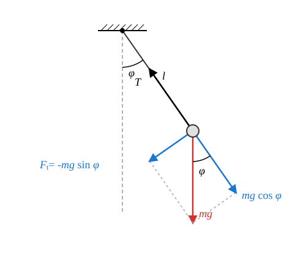
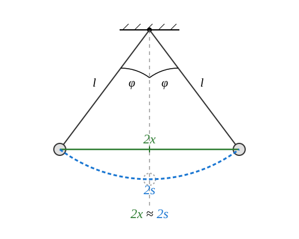

# The Simple Mathematical Pendulum

## The Concept of the Simple Pendulum

> **Simple pendulum:** A point-like body that can perform oscillations under the influence of the gravitational force on an inextensible string of fixed length and negligible mass. The other end of the string is fixed in a reference frame attached to the Earth. During the oscillations, the string remains taut.

### Experiment

[Demonstration of a Conical Pendulum](https://www.youtube.com/watch?v=1R5jpNTSxDg)

The experiment beautifully shows that for the case of small opening angles, the period of the conical pendulum matches approximately with the period of the simple pendulum. The uniform circular motion of the conical pendulum happens in synchronization with the oscillations of the pendulum, provided that the opening angle of the cone matches the angle of the pendulum's oscillation and these are started at the same time. According to this, the pendulum performs a simple harmonic motion to a good approximation in the case of small displacements.

For the period, we also obtained the formula that we are going to derive for the oscillations of the pendulum. However, the agreement is true only for the limiting case of small cone angles!

$$
T = 2\pi \sqrt{ \frac {l \cos \Theta} {g} }
$$

If $r$ is the radius of revolution and $l$ is the length of the string, then it is valid that:

$$
\cos \Theta = \frac {\sqrt {l^2 - r^2}} {l} = \sqrt {1 - \left(\frac r l\right)^2}
$$

In the event that $r \ll l$,

$$
\cos \Theta \approx 1
$$

therefore we obtain the following formula for the period of the pendulum with small displacement:

$$
T = 2\pi \sqrt{ \frac l g }
$$

## The Equation of Motion

Only the gravitational force and the string tension force $T$ act on the body. The string tension force points in the direction of the string, while the gravitational force points vertically downward. Let us resolve the gravitational force into its components parallel to the string and perpendicular to it, therefore in the tangential direction! The pendulum performs circular motion, but this is not uniform circular motion. For the components in the direction of the string, the following relationship is valid:

$$
T - mg\cos\phi = ma_{cp} = m\frac {v^2} {l} = ml\omega^2
$$

This equation is suitable for determining the force developing in the string. Right now we are not interested in this. The equation interesting for us relates to the tangential components. Let the positive direction of the components be the direction determined by the increase of the displacement angle $\phi$! In this case, the tangential force is the following:

$$
F_t = -mg\sin\phi
$$

The force is negative because it tries to decrease the displacement $\phi$, provided that $\phi$ is positive. According to Newton's second law:

$$
F_t = ma_t
$$

Therefore

$$
ma_t = -mg\sin\phi
$$

That is to say

$$
a_t = -g\sin\phi
$$

The signed value of the tangential acceleration can be obtained from the angular acceleration $\alpha$ as follows:

$$
a_t = l\alpha
$$

This is true because the radius of the circular motion in our case is $l$, the length of the string.

$$
l\alpha = -g\sin\phi
$$

Therefore, the final form of the equation of motion is the following:

$$
\alpha = - \frac g l \sin\phi
$$

For the angle $\phi$, we obtained an equation similar to the equation of motion analogous to simple harmonic motion. Instead of acceleration, the angular acceleration appears here, but on the right side of the equation, instead of the angle $\phi$, its sine appears. We would expect the appearance of the angle $\phi$, because then the equation could be solved with a cosine function for the variation of the unknown angle $\phi$ over time, therefore the motion in that case would be simple harmonic motion for the angle $\phi$! Although this equation can be solved, its solution is possible only with advanced mathematics and is difficult even there, because it leads to the application of special functions. We choose another path.

## Limiting Case of Small Angles

Now let the angle $\phi$ be very small during the entire duration of the oscillation! In this case, the sine function becomes the following:

$$
\sin\phi = \frac {x} {l} \approx \frac {s} {l} = \phi
$$

Here, the essence of our approximation is that we replaced the arc length $2s$ with the corresponding chord of length $2xfx$, which is a straight line segment. This is obviously more accurate the smaller the displacement $\phi$ is. This means that in this special case, the following approximations are justified:

$$
x \approx s
$$

$$
\sin \phi \approx \phi
$$

Therefore, the equation of motion of the pendulum in the case of small displacements takes the following form:

$$
\alpha = -\frac g l \phi
$$

Let us introduce the following notation!

$$
\omega^2 = \frac g l
$$

In this case, the solution of the equation is a periodic oscillation for the angle $\phi$. If we release the pendulum from its extreme position without velocity, then this function is the following:

$$
\phi = \phi_{max} \cos(\omega t)
$$

Multiplying this equation by the length $l$ of the string, we get that:

$$
s = A\cos(\omega t)
$$

Based on our approximation, the arc length $s$ can be replaced by the distance $x$ measured from the vertical axis of symmetry, so:

$$
x = A\cos(\omega t)
$$

This is, of course, true only if the maximum displacement angle $\phi_{max}$ of the pendulum is also very small in radians.

## The Period

$$
\omega^2 = \frac g l
$$

$$
\omega = \frac {2\pi} {T}
$$

$$
\frac {4\pi^2} {T^2} = \frac g l
$$

Let us take the reciprocal of both sides!

$$
\frac {T^2} {4\pi^2} = \frac l g
$$

$$
T^2 = 4\pi^2 \frac l g
$$

Finally, taking the square root of both sides, we get the following formula:

$$
T = 2\pi \sqrt {\frac l g}
$$

We see that the period does not depend either on the amplitude or on the mass of the oscillating body. However, the independence from the amplitude is true only for the limiting case of small displacements.

### Example
Let us calculate the period of a $1\text{ m}$ long pendulum! This is also usually called a seconds pendulum. What is the reason for this?

$$
T = 2\pi \sqrt{\frac l g} = 2 \cdot 3.1415 \cdot \sqrt {\frac{1}{9.81}} = 2.0060\text{ s}
$$

The half period of this pendulum (therefore until it swings from one extreme position to the opposite extreme position) is approximately 1 second. The error is only about 3 per mille, but $g$ and thus the error as well depends slightly on the geographical location.

### Simulation

[The Simple Pendulum](https://alexerdei73.github.io/physics-engine/project/#be74d75b-d4ef-49e0-ac4e-98ff80ff6a54)

In the simulation, the body starts from the bottom, equilibrium position with a push. The length of the pendulum is $3\text{ m}$, the gravitational acceleration is $9.80\ \text{m/s}^2$.

* Let us measure the duration of the first 10 oscillations! Since the pendulum does not start from the extreme position, but it is practical for us to stop the simulator at the extreme position, to calculate the period, the time shown by the simulator must be divided by 10.25, since we measure 10 and a quarter oscillations.
* Let us also calculate the period from the data. How large an error can we expect? Which is the most important source of error and how large is the actual error?

## Problems

1. A student wants to make a simple pendulum in the school laboratory that has a period of exactly $2.5\text{ s}$. How long a string must they use for this, if the acceleration due to gravity is considered to be $g = 9.81\ \text{m/s}^2$?

2. An astronaut lands on a foreign planet and experiments with a $0.8\text{ m}$ long simple pendulum. They measure that the pendulum completes $15$ full oscillations in exactly $30\text{ s}$. How large is the acceleration due to gravity on this unknown planet?

3. We compare the periods of two simple pendulums. The string of one pendulum is exactly nine times as long as that of the other pendulum. In what ratio do the periods of the two pendulums stand to each other? Justify your answer based on the formula learned!