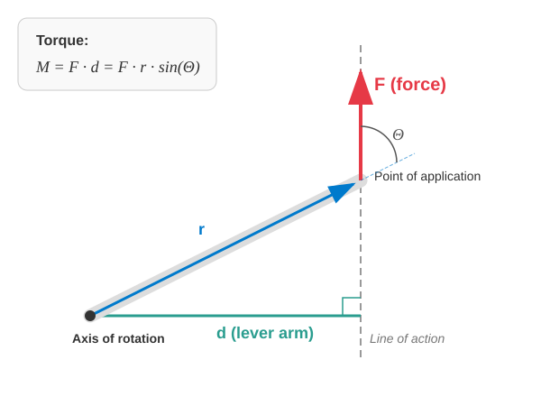

# Rigid Bodies

## The Concept of a Rigid Body

Up until now, we have mainly focused on the motion of bodies that could be treated as point masses, because the scales of their displacements were significantly larger than the dimensions of the objects themselves. We did not address the rotation of these point masses, and their internal structure was completely ignored.

We have also studied systems of particles when tracking the collective motion of two or more point masses. Examples included the two-body problem, or the concept of the center of mass and its corresponding theorem.

> **Rigid bodies are essentially special systems of particles where the distance between any two chosen point masses remains constant.**

In reality, perfect rigid bodies do not exist, as any solid object will visibly alter its shape under a sufficiently large force. Examples of such deformation include a car chassis buckling during an accident, or a spring snapping when overloaded. Frequently, deformations are minor, and the body can fully recover its shape once the external force ceases. A spring stretched within reasonable limits provides an example of this behavior. These changes are called elastic deformations, which are studied in the field of elasticity theory. For our purposes, we assume that the external forces acting on a rigid body are small enough that any deformation is completely negligible.

## Motion of a Rigid Body

Since a rigid body does not change its shape during motion, its displacement can always be decomposed into a succession of a translation and a rotation. Consequently, a rigid body can undergo rotational motion in addition to translational motion.

## Planar Motion of a Rigid Body

We are primarily interested in a specific type of motion known as the planar motion of a rigid body. In this case, the particles of the rigid body move parallel to a fixed reference plane, meaning that the velocity of every particle is parallel to this specified plane.

> **During the planar motion of a rigid body, the particles of the body move with velocity vectors that are parallel to a given plane.**

Consider a rolling wheel moving along a straight line. The points of the wheel typically move in a vertical plane that is parallel to the direction of rolling. When analyzing this motion, we focus entirely on the two-dimensional projection of the movement, meaning the three-dimensional extension of the body perpendicular to the plane becomes irrelevant.

In planar motion, the configuration of the body is uniquely determined by the coordinates of two of its points. Since the distance between these two points is fixed, only 3 independent variables are needed. These can be chosen, for example, as the 2 coordinates of the center of mass within the plane and the angle of rotation of the body in that plane. For a wheel, the geometric center is usually also the center of mass, and the wheel rotates about an imaginary axis passing through this point perpendicular to the plane of motion. The angle of rotation is a signed number: it is positive if the object rotates counter-clockwise in the plane, and negative if it rotates clockwise.

## Torque (Moment of Force)

What is the rotational equivalent of a force that is responsible for accelerating or decelerating rotation? This quantity is torque (or the moment of force).

Here, we must establish a few key definitions:

> **The point of application of a force is the exact point where the force is exerted on the body.**
>
> **The line of action of a force is the straight line passing through the point of application that runs parallel to the direction of the force vector.**
>
> **The lever arm (or moment arm) is the perpendicular distance from the axis of rotation to the line of action of the force.**

With these concepts, we can easily state the definition of torque.

> **The torque of a force is the product of the force and its lever arm.**

$$
M = Fd = Fr \sin \Theta
$$

Here, $\Theta$ is the angle (no greater than $180^\circ$) enclosed by the force vector and the position vector of the point of application, with the origin chosen at the axis of rotation. The angle is a signed rotational angle. If the force induces a positive rotation—counter-clockwise—the angle is taken as positive; otherwise, it is negative. Consequently, torque is also a signed quantity, as the sine function retains the same sign as its angle within these bounds.

### Experiment

[Elemér Sas demonstrates the thread spool paradox](https://www.youtube.com/watch?v=Fodof4gSIA0&t=8m50s)

The concept of torque and the role of the lever arm are elegantly illustrated by the classic thread spool experiment. If the thread is pulled steeply, close to the vertical, the spool rolls away. However, if the thread is pulled at a shallow, small angle close to the horizontal, the spool reverses its direction of rotation and rolls back toward the direction of the pull. 

The explanation for this phenomenon lies in the fact that the instantaneous axis of rotation is not the symmetry axis of the spool, but rather the line of contact between the spool and the table. When pulling steeply, the line of action of the force passes the axis of rotation in a direction that creates a forward-rolling torque. At a small angle of inclination, the line of action intersects the table surface behind the point of contact, reversing the position of the lever arm and causing an opposing torque that rolls the spool backward. If the line of action of the force passes exactly through the axis of rotation, the length of the lever arm becomes zero, yielding no rotational effect, and the spool undergoes pure sliding motion.

### Examples

1. A wrench has a length of $30.0\text{ cm}$. A force of $60\text{ N}$ is applied at the end of the wrench. In which case is the torque greater? In the first case, the force is perpendicular to the wrench. In the second case, the force encloses an angle of $60^\circ$ with the wrench.

$$
M_1 = Fr \sin \Theta = 60 \cdot 0.3 \cdot \sin 90^\circ = 18\text{ N}\cdot\text{m}
$$

$$
M_2 = Fr \sin \Theta = 60 \cdot 0.3 \cdot \sin 60^\circ \approx 15.58\text{ N}\cdot\text{m}
$$

Thus, the torque, and consequently the rotational effect of the force, is smaller in the second case.

2. The lever of a hoist is positioned horizontally. A mass of $20\text{ kg}$ is placed at a distance of $2.00\text{ m}$ from the axis of rotation. On the opposite side of the axis, the lever is pushed vertically downward with a force of $130\text{ N}$ at a distance of $3.00\text{ m}$ from the axis. The acceleration due to gravity is $9.81\text{ m/s}^2$. What are the torques acting on the lever, and in which direction does it tilt?

$$
|M_1| = F_1 d_1 = m g r_1 = 20 \cdot 9.81 \cdot 2 = 392.4\text{ N}\cdot\text{m}
$$

$$
|M_2| = F_2 d_2 = F_2 r_2 = 130 \cdot 3 = 390.0\text{ N}\cdot\text{m}
$$

Since $|M_2|$ is smaller than $|M_1|$, the lever tilts toward the load.

## The Torque of the Gravitational Force

A crucial question is how to account for the torque produced by the gravitational force. Let the axis of rotation be placed at the origin along the $z$-axis. Let the gravitational force act downwards, opposite to the $y$-axis. In this configuration, the lever arm corresponds to the $x$-coordinate.

$$
M_z = \sum_{i = 1}^{N} -m_i g x_i = -Mg \frac{\sum_{i = 1}^{N} m_i x_i}{M} = -Mg x_{\text{CM}}
$$

The point of application of the total gravitational force can be shifted arbitrarily along its vertical line of action without changing the net torque.

> **The effect of the total gravitational force can be combined into a single force of magnitude $Mg$, acting vertically downward, with its point of application located at the center of mass of the body.**

This allows the torque of the gravitational force to be calculated easily when solving problems.

### Example

A beam has a length of $6.00\text{ m}$ and a mass of $60.0\text{ kg}$. The horizontal beam is supported at one of its endpoints and at a point located $2.00\text{ m}$ away from the opposite endpoint, about which it can rotate. How far can a worker with a mass of $80\text{ kg}$ walk along the beam from this pivot point toward the free end before the beam begins to tip over?

Let the free end be on the right side. In this case, the center of mass of the beam is located to the left of the axis of rotation at a distance of $1.00\text{ m}$. Since this side tends to rotate the beam counter-clockwise, its torque is positive:

$$
M_{z,1} = -Mg x_{\text{CM}} = -60 \cdot 9.81 \cdot (-1) = 588.6\text{ N}\cdot\text{m}
$$

Let the worker be at a distance $x$ to the right of the pivot point. Since the worker tends to rotate the beam clockwise, this torque is negative:

$$
M_{z,2} = -mgx = -80 \cdot 9.81 \cdot x = -784.8x\text{ N}\cdot\text{m}
$$

The sum of the two external torques is exactly zero at the critical moment before the beam begins to tip over.

$$
M_{\text{z,net}}^{\text{ext}} = M_{z,1} + M_{z,2} = 0
$$

$$
588.6 - 784.8x = 0
$$

The solution is:

$$
x = \frac{588.6}{784.8} = 0.75\text{ m}
$$

Therefore, the worker cannot walk farther than $0.75\text{ m}$ from the support point toward the free end without the beam tipping over.

### Experiment

[Dancing doll](https://www.youtube.com/shorts/wuvrJnYLCV8)

## Conditions for the Equilibrium of a Rigid Body

We know from earlier that for any system of particles to be in equilibrium, it is necessary for the vector sum of the external forces to be zero. As we can see from the examples, this is not sufficient. It is also required that the net external torque be zero.

$$
\sum_{i = 1}^{N} \vec{F}_i^{\text{ext}} = \vec{0}
$$

$$
\sum_{i = 1}^{N} M_{z,i}^{\text{ext}} = 0
$$

The latter condition applies to planar motion, which would occur in the $x$-$y$ plane if equilibrium were not maintained. For absolute equilibrium in three-dimensional space, the torque about all three axes must be $0$. For equilibrium, the position of the axis is not critical, but its direction is. We can state that in three-dimensional space, the condition for the equilibrium of a system of particles is that the torque about an arbitrary axis must be zero. For rigid bodies, these two conditions are entirely sufficient, since they cannot undergo deformations, leaving only rotational and translational motions possible.

---

## Practice Exercises

1. **The Ladder Problem:** A ladder of length $4.0\text{ m}$ and mass $10\text{ kg}$ rests against a smooth (frictionless) vertical wall. The base of the ladder is on horizontal ground at a distance of $1.5\text{ m}$ from the wall. The ground is not smooth; friction is present there. What force does the ladder exert on the wall, and what are the vertical normal force and the horizontal friction force at the base of the ladder if the ladder is in equilibrium? (Hint: write down the torque equation about the base of the ladder, then the force equilibrium equations in the $x$ and $y$ directions. Use the value $g = 9.81\text{ m/s}^2$ during the calculation.)

2. **Bridge Support:** A uniform bridge of length $20.0\text{ m}$ has a mass of $10\text{ t}$. The bridge is supported at its two endpoints (points $A$ and $B$). A truck of mass $5.0\text{ t}$ stops on the bridge such that its center of mass is at a distance of $5.0\text{ m}$ from support "$A$". Calculate the supporting forces (reaction forces) $F_A$ and $F_B$ generated at the two supports.

3. **Shop Sign:** A shop sign is attached to a horizontal rod of length $2.0\text{ m}$ and mass $8.0\text{ kg}$ above the entrance of a shop. One end of the rod is hinged to the wall, while the other end is supported by a cable that encloses an angle of $30^\circ$ with the wall (pointing upwards). The mass of the sign is $12\text{ kg}$, and it hangs from the free end of the rod. What is the tension force stretching the cable?

4. **Tower Crane:** The horizontal jib of a tower crane is asymmetrical. The arm extending in one direction from the axis of rotation is $15\text{ m}$ long (counterweight side), and in the other direction, it is $45\text{ m}$ long (load side). The total mass of the jib is $3\text{ t}$, and its center of gravity lies exactly on the axis (so it produces no torque). The counterweight has a mass of $5\text{ t}$ and is placed at a distance of $12\text{ m}$ from the axis. What maximum load mass can be lifted at the end of the jib ($45\text{ m}$ away) so that the crane just barely remains in equilibrium?

5. **Wheelbarrow:** The total length of a wheelbarrow from the wheel axle to the tip of the handle is $1.5\text{ m}$. The center of gravity of the loaded wheelbarrow is at a distance of $0.5\text{ m}$ from the wheel axle. The combined mass of the load and the wheelbarrow is $60\text{ kg}$.
    * a) What vertical force must we apply to the handle to maintain equilibrium?
    * b) What force loads the wheel axle of the wheelbarrow during this time?