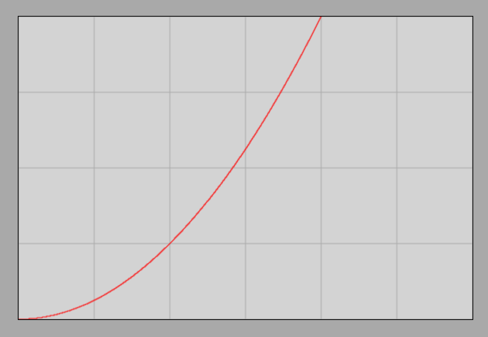
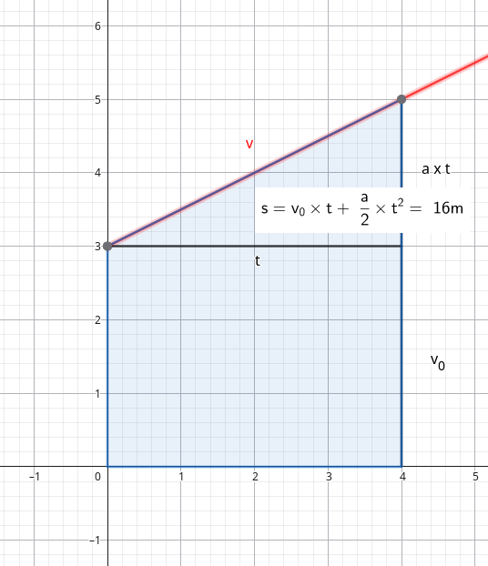

# The Quadratic Law of Motion

## Calculating Distance
Let us recall the velocity-time graph for the case of an object moving down an inclined plane where the acceleration is $0.5\text{ }\frac{\text{m}}{\text{s}^2}$.

We also remember that the area under the instantaneous velocity curve (line) universally represents the distance traveled.

Based on this, we can easily calculate the distance traveled in the case where the initial velocity $v_0$ is $0$. In this case, the velocity reached at time instant $t$ is:

$$
a = \frac {v - v_0} {t} = \frac {v} {t}
$$

Multiplying both sides by $t$, we obtain:

$$
v = a \cdot t
$$

Now we need to determine the area of a right-angled triangle whose right-angle vertex lies on the time axis (horizontal axis) at time instant $t$. One leg is therefore $t$, and the other is $a \cdot t$. The area of a right-angled triangle is exactly half the area of the rectangle, therefore:

$$
s = \frac {(a \cdot t) \cdot t} {2}
$$

The target formula, which we call the quadratic law of motion, is:

$$
s = \frac {a} {2} \cdot t^2
$$

> **The distance traveled by a uniformly accelerating motion starting from rest (zero initial velocity) is directly proportional to the square of time; the proportionality factor is half of the acceleration.**

### Example
What distance is covered in $4\text{ s}$ by an object sliding down an inclined plane from rest if its acceleration is $0.5\text{ }\frac{\text{m}}{\text{s}^2}$?

$$
s = \frac {a} {2} \cdot t^2 = \frac {0.5\text{ }\frac{\text{m}}{\text{s}^2}} {2} \cdot 16\text{ s}^2 = 4\text{ m}
$$

This example represents exactly the motion plotted on the graph. It can be seen from the graph, however, that the area under the velocity line up to $4\text{ s}$ is exactly $4\text{ unit squares}$ (2 whole large squares and 2 halved whole squares).

## The Distance-Time Graph
Let us now examine the distance-time graph, which we can also obtain via the simulation. From this, we obviously must read a value of $4\text{ m}$ after an elapsed time of $4\text{ s}$.

[Frictionless Motion on an Inclined Plane Simulator](https://alexerdei73.github.io/physics-engine/project/#94f47c36-ead0-4d85-a1ff-ac1827797ce9)

For practice, let us look at the image of the distance-time graph based on the simulation! We should obtain the following graph:

It is clear that the distance traveled is indeed $4\text{ m}$ after an elapsed time of $4\text{ s}$. The curve is called a parabola.

## The Quadratic Law of Motion with Initial Velocity

If there is also an initial velocity, the velocity-time graph is as follows:

Let us look at the final velocity reached:

$$
a = \frac {v - v_0} {t}
$$

$$
v - v_0 = a \cdot t
$$

$$
v = v_0 + a \cdot t
$$

The distance traveled is now the area of the trapezoid. This area is visibly the sum of the area of the previous right-angled triangle and the area of a rectangle. The sides of the rectangle are $t$ and $v_0$, so its area is $v_0 \cdot t$.
Thus, the formula we are looking for is:

$$
s = v_0 \cdot t + \frac {a} {2} \cdot t^2
$$

We can also arrive at this formula in another way. We know that the area of a trapezoid is the average of the parallel sides multiplied by the distance between the parallel sides. The parallel sides are $v_0$ and $v$, and their distance is $t$. According to this:

$$
s = \frac {v_0 + v} {2} \cdot t
$$

Dividing this relationship by $t$ yields the average velocity:

$$
\overline{v} = \frac{s}{t} = \frac {v_0 + v} {2}
$$

> **The average velocity of uniformly accelerated motion is the arithmetic mean of the initial and final velocities.**

This statement does not hold true for other types of motion.

Let us see if we can obtain the relationship used to calculate the distance traveled through some algebraic manipulation!

$$
s = \frac {v_0 + v} {2} \cdot t = \frac {v_0 + v_0 + a \cdot t} {2} \cdot t = \frac{1} {2} \cdot (2v_0 + a \cdot t) \cdot t = \frac {1} {2} \cdot (2v_0 \cdot t + a \cdot t^2) = v_0 \cdot t + \frac {a} {2} \cdot t^2
$$

Thus, we have obtained the relationship via this alternative route as well.

### Example
An object sliding down an inclined plane moves without friction with an acceleration of $0.5\text{ }\frac{\text{m}}{\text{s}^2}$ and its initial velocity is $3\text{ }\frac{\text{m}}{\text{s}}$. What will the velocity of the object be $4\text{ s}$ after launching? What distance does it cover during this time?

$$
a = \frac {v - v_0} {t}
$$

Substituting the data and denoting the unknown velocity by $x$:

$$
0.5 = \frac {x - 3} {4}
$$

We solve the equation:

$$
2 = x - 3
$$

$$
5 = x
$$

Therefore, the velocity of the object at $4\text{ s}$ is $5\text{ }\frac{\text{m}}{\text{s}}$.

The distance is calculated by simple substitution:

$$
s = v_0 \cdot t + \frac {a} {2} \cdot t^2 = 3 \cdot 4 + \frac {0.5} {2} \cdot 4^2 = 12 + 0.25 \cdot 16 = 16\text{ m}
$$
