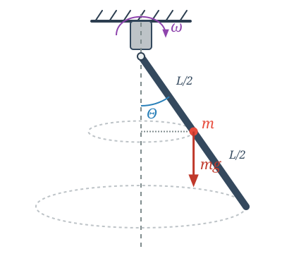

# An Advanced Problem on Rotational Motion *

## Example

A rod of mass $m$ and length $L$ is pivoted at its top and is capable of oscillating in a vertical plane. The rod, together with its pivot assembly, is able to rotate around a vertical axis passing through the pivot. A motor rotates the pivot assembly and maintains it at a constant angular velocity $\omega$. What angle $\Theta$ does the rod make with the vertical during its rotation if this angle remains constant?

The points of the rod perform circular motion in a horizontal plane, meaning their acceleration is the centripetal acceleration. The angle $\Theta$ does not change, meaning the rod has no angular acceleration in the coordinate system rotating along with it. Is there an angular acceleration in the inertial reference frame? If we resolve the acceleration of the points into components parallel and perpendicular to the rod, then for a non-zero angle $\Theta$, there will be a component of acceleration perpendicular to the rod, which represents an angular acceleration relative to the horizontal axis of rotation.

$$
a_{i,\text{t}} = r_i \sin \Theta\ \omega^2 \cos \Theta
$$

$$
\alpha = \frac{a_{i,\text{t}}}{r_i} = \omega^2 \sin \Theta \cos \Theta
$$

Let us write the fundamental equation of rotational motion for the horizontal axis about which the rod can turn!

$$
M_{z,\text{net}}^{\text{ext}} = I_{\text{rod}} \alpha
$$

Only the gravitational force exerts a torque:

$$
M_{z,\text{net}}^{\text{ext}} = mg \frac{L}{2} \sin \Theta
$$

Substituting these expressions along with the moment of inertia of the rod relative to its endpoint, $I_{\text{rod}} = \frac{1}{3}mL^2$, we obtain the following equation:

$$
mg \frac{L}{2} \sin \Theta = \frac{1}{3} mL^2 \omega^2 \sin \Theta \cos \Theta
$$

$$
\left( \frac{g}{2} - \frac{L\omega^2}{3}\cos \Theta \right)\sin \Theta = 0
$$

This equation generally has two solutions.

Solution 1:

$$
\sin \Theta = 0 \quad \rightarrow \quad \Theta = 0^\circ
$$

This is a stable solution for low angular velocities $\omega$. More precisely, it remains stable as long as the second solution does not exist.

Solution 2:

$$
\frac{g}{2} = \frac{L\omega^2}{3} \cos \Theta
$$

From here, we can express the value of $\cos \Theta$:

$$
\cos \Theta = \frac{3g}{2L\omega^2}
$$

Since the value of the cosine function cannot be greater than one:

$$
\cos \Theta \leqslant 1
$$

Thus, the angular velocity of the motor must be greater than a minimum critical value for this stable deflected solution to exist at all:

$$
\frac{3g}{2L\omega^2} \leqslant 1 \quad \rightarrow \quad \omega \geqslant \sqrt{\frac{3g}{2L}}
$$

It can be shown that as soon as the motor's speed crosses this critical limit, the vertical position becomes unstable, and the rod spontaneously deflects to the stable equilibrium angle $\Theta > 0$.

---

## Analogy Between Translational and Rotational Motion

| Translational Motion | Rotational Motion |
| :--- | :--- |
| Displacement ($s = r\phi$) | Angle ($\phi$) |
| Velocity ($v = r\omega$) | Angular velocity ($\omega$) |
| Acceleration ($a = r\alpha$) | Angular acceleration ($\alpha$) |
| Force ($F$) | Torque ($M = Fr \sin \Theta$) |
| Mass ($m$) | Moment of inertia ($I = \sum_{i = 1}^{N} m_i r_i^2$) |
| Linear momentum ($p = mv$) | Angular momentum ($L = I \omega$) |
| $F_{\text{net}} = ma$ | $M_{\text{net}}^{\text{ext}} = I \alpha$ |
| $\vec{F}_{\text{net}} = \frac{\Delta \vec{p}}{t} \quad (t \rightarrow 0)$ | $\vec{M}_{\text{net}}^{\text{ext}} = \frac{\Delta \vec{L}}{t} \quad (t \rightarrow 0)$ |
| $E_{\text{kin}} = \frac{mv^2}{2}$ | $E_{\text{rot}} = \frac{I \omega^2}{2}$ |

---

## Problems

**Problem 1 (Supporting Forces)**

Determine the horizontal and vertical components of the supporting force acting on the pivot in the example above when the motor rotates at an angular velocity of $\omega > \sqrt{\frac{3g}{2L}}$ and the rod has settled into its stable equilibrium position $\Theta > 0$!
*(Hint: Write down the fundamental equation of translational motion for the horizontal circular path of the rod's center of mass!)*

**Problem 2 (Rotating Ring)**

A circular ring of radius $R$ made of thin wire rotates around its vertical diameter at a constant angular velocity $\omega$. A small bead of mass $m$ can slide without friction along the ring.

* a) For what angular velocities $\omega$ will the stable equilibrium position of the bead be located somewhere other than the lowest point of the ring?
* b) Determine this equilibrium position (the angle $\varphi$ enclosed with the vertical) as a function of the angular velocity!