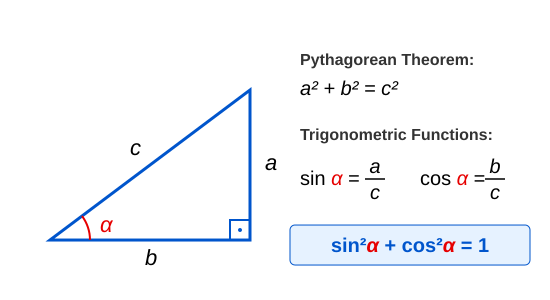
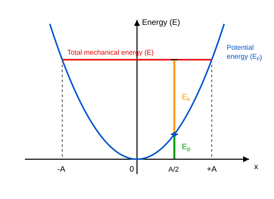

# Energy of Harmonic Oscillation

## Example 
One end of a spring with a spring constant of $200 \text{ N/m}$ is fixed on a horizontal, frictionless table. At the other end of the spring, an object with a mass of $10 \text{ g}$ performs simple harmonic motion with an amplitude of $0.2 \text{ m}$.

* What is the angular frequency?
* What is the elastic energy of the spring at maximum displacement?
* What is the magnitude of the maximum velocity of the body?
* What is the maximum kinetic energy of the body?
* Calculate the signed values of displacement and velocity at $t = 0.01 \text{ s}$! The body starts from the $+A$ position.
* Calculate the sum of the kinetic and potential energy at this same instant!

$$
\omega = \sqrt{\frac{D}{m}} = \sqrt{\frac{200}{0.01}} \approx 141.42 \text{ s}^{-1}
$$

The elastic energy is at its maximum at the extreme position when the displacement equals the amplitude—meaning the maximum displacement.

$$
E_{\text{e},\text{max}} = \frac{D A^2}{2} = \frac{200 \cdot 0.2^2}{2} = 4 \text{ J}
$$

Based on the analogy with circular motion—where the radius is the amplitude—the maximum value of velocity is:

$$
v_{x,\text{max}} = A\omega = 0.2 \cdot 141.42 \approx 28.284 \text{ m/s}
$$

Therefore, the maximum kinetic energy is:

$$
E_{\text{k},\text{max}} = \frac{m v_{x,\text{max}}^2}{2} = \frac{0.01 \cdot 28.284^2}{2} \approx 4.000 \text{ J}
$$

Let us calculate the displacement and velocity at $t = 0.01 \text{ s}$:

$$
x = A\cos(\omega t) = 0.2\cos(141.42 \cdot 0.01) \approx 0.031191 \text{ m}
$$

$$
v_x = -A\omega\sin(\omega t) = -0.2 \cdot 141.42 \cdot \sin(141.42 \cdot 0.01) \approx -27.938 \text{ m/s}
$$

Let us also calculate the total mechanical energy:

$$
E = \frac{m v_x^2}{2} + \frac{D x^2}{2} = \frac{0.01 \cdot (-27.938)^2}{2} + \frac{200 \cdot 0.031191^2}{2} \approx 4.000 \text{ J}
$$

We can see that the total energy is always $4 \text{ J}$, regardless of the displacement of the body or time.

### Simulation

[Example Demonstrating Oscillational Energy](https://alexerdei73.github.io/physics-engine/project/#7d6e9374-6fcf-4c85-97c1-69d72a3a796c)

## Pythagorean Theorem in Trigonometry

Let the two legs of a right-angled triangle be $a$ and $b$, and its hypotenuse be $c$! In this case, the Pythagorean theorem states:

$$
a^2 + b^2 = c^2
$$

$$
\left(\frac{a}{c}\right)^2 + \left(\frac{b}{c}\right)^2 = 1
$$

We know that the definitions of trigonometric functions in a right-angled triangle are:

$$
\sin \alpha = \frac{a}{c}
$$

$$
\cos \alpha = \frac{b}{c}
$$

Substituting these into the previous relationship yields the trigonometric form of the Pythagorean theorem:

$$
\sin^2\alpha + \cos^2 \alpha = 1
$$

## Mechanical Energy of Simple Harmonic Motion

Let us now determine the total mechanical energy—the sum of the kinetic energy and the elastic potential energy—of the body undergoing simple harmonic motion in the lossless case examined so far. We already know all the necessary relationships.

$$
E = E_{\text{k}} + E_{\text{e}} = \frac{m v_x^2}{2} + \frac{D x^2}{2}
$$

We also know how to calculate the displacement and velocity of simple harmonic motion:

$$
x = A\cos(\omega t)
$$

$$
v_x = -A\omega\sin(\omega t)
$$

Substituting these relationships and performing the algebraic operations yields:

$$
E = \frac{m A^2 \omega^2 \sin^2(\omega t)}{2} + \frac{D A^2 \cos^2(\omega t)}{2}
$$

Now we take into account the formula used to calculate $\omega$:

$$
\omega^2 = \frac{D}{m}
$$

Let us substitute this in as well!

$$
E = \frac{D A^2 \sin^2(\omega t)}{2} + \frac{D A^2 \cos^2(\omega t)}{2} = \frac{D A^2}{2} \left( \sin^2(\omega t) + \cos^2(\omega t) \right)
$$

Using the trigonometric form of the Pythagorean theorem, we can see that mechanical energy remains constant during simple harmonic motion!

$$
E = \frac{D A^2}{2} = \frac{m \omega^2 A^2}{2} = \frac{m v_{x,\text{max}}^2}{2}
$$

Here, we have once again used the relationships $D = m\omega^2$ and $v_{x,\text{max}} = A\omega$.

> **The energy of simple harmonic motion is constant over time, provided there are no losses such as friction or air resistance. The total energy is proportional to the square of the amplitude.**

## Potential Energy Function of Simple Harmonic Motion

Let us plot the potential energy of a body attached to a spring as a function of displacement on a graph! We obtain a parabolic curve. If we draw a horizontal line representing the constant total energy, it intersects the parabola precisely at the points $x = \pm A$. Since kinetic energy cannot become negative, the body can only be located between these two points. The sum of the non-negative kinetic energy and potential energy at any point yields the total energy.

### Example
Determine the potential energy and kinetic energy of the oscillating body from the previous example at the displacement points $x = \pm \frac{A}{2}$—meaning for $x = \pm 0.1 \text{ m}$!

We saw that the total energy is $4 \text{ J}$. If the magnitude of displacement is half the amplitude, then the potential energy is one-quarter of the total energy, which is $1 \text{ J}$, and the kinetic energy is $3 \text{ J}$.

---

## Problems

1. The total mechanical energy of a body performing simple harmonic motion is $12 \text{ J}$. The spring constant is $600 \text{ N/m}$. Determine the amplitude of the oscillation!
2. A body with a mass of $0.5 \text{ kg}$ performs simple harmonic motion. When the displacement of the body is $0.05 \text{ m}$, its velocity is $2 \text{ m/s}$. The angular frequency of the oscillation is $10 \text{ rad/s}$. Determine the total mechanical energy of the body and its amplitude!
3. At which displacement point (expressed as a function of the amplitude) will the kinetic energy of a body performing simple harmonic motion be exactly equal to its elastic potential energy?
