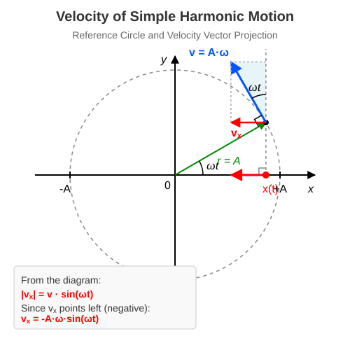

# Velocity of Harmonic Oscillation

## Determining Velocity
In simple harmonic motion, the velocity obviously lies along the straight line of the motion. However, how it changes over time is not immediately obvious, as the displacement continuously varies in a seemingly complex manner. Fortunately, the relationship with uniform circular motion helps here as well. We already know the velocity of circular motion. Since the $x$-coordinate of the object performing circular motion is exactly equal to the $x$-coordinate of the oscillating object at every instant, it is clear that the $x$-components of their velocities must also match at every instant! This is because the average velocity along the $x$-axis is given by:

$$
\overline {v_x} = \frac {x - x_0} {t}
$$

Of course, this does not equal the instantaneous velocity. However, if we choose the time interval $t$ to be so small that the change in velocity during this time is negligibly small, then the average velocity matches the instantaneous velocity within our computational accuracy. Thus, it is clear that the instantaneous velocity must indeed be equal to the $x$-component of the velocity of the object performing circular motion at every moment.

The velocity of the object performing circular motion has a magnitude of $r\omega$ and is tangential at every instant, meaning it encloses an angle of $\omega t$ with the vertical line parallel to the $y$-axis. Thus, we obtain:

$$
v_x = -A\omega \sin (\omega t)
$$

Here, we have utilized the fact that $r = A$ for simple harmonic motion based on our previous discussions. The object is at the position $x = +A$ at $t = 0$, as assumed in the previous lesson.

### Example
The function describing the displacement of an object suspended on a spring and performing simple harmonic motion is:

$$
x = 0.2 \cos (4\pi \cdot t)
$$

Here, $x$ is in metres (m) and $t$ is in seconds (s)! Let us find the most important parameters of the motion.

* What is the amplitude?  
* What is the angular frequency? 
* Write down the expression describing the velocity $v_x$! 
* What are the signed values of the displacement and the velocity at $t = 0.1\text{ s}$?
* What is the maximum value of the velocity?

From the general form of the displacement-time function, $x = A \cos(\omega t)$, we can read:
  
$$
A = 0.2\text{ m}
$$

We can also read the multiplier of $t$ directly from the function:
  
$$
\omega = 4 \pi \text{ rad/s}
$$

Substituting the known data into the relationship $v_x = -A\omega \sin(\omega t)$ (since $-0.2 \cdot 4\pi = -0.8\pi$):
  
$$
v_x(t) = -0.8\pi \sin (4\pi \cdot t)
$$
  
The value of the displacement, substituted into the original function:
  
$$
x = 0.2 \cos (4 \pi \cdot 0.1) = 0.06180\text{ m}
$$

The value of the velocity, substituted into the velocity function we wrote:
  
$$
v_x = -0.2 \cdot 4 \pi \cdot \sin (4 \pi \cdot 0.1) = -2.390\text{ m/s}
$$

The velocity is at its maximum when the value of the sine term is 1 (or -1). Thus, the magnitude of the maximum velocity is:
  
$$
v_{\max} = A\omega = 0.2 \cdot 4\pi \approx 2.513\text{ m/s}
$$

## Problems

1. The displacement-time function of a body performing simple harmonic motion is: $x(t) = 0.5 \sin(2\pi \cdot t)$ (where the units correspond to the SI system). Determine the amplitude of the oscillation, its period, and the maximum velocity of the body!

2. A body attached to a spring on a horizontal surface undergoes simple harmonic motion. The amplitude of the motion is $A = 4\text{ cm}$, and its period is $T = 2\text{ s}$. Write down the velocity-time function $v_x(t)$ of the body, assuming that the body was at the positive maximum displacement ($+A$) at the moment $t = 0\text{ s}$!

3. The maximum velocity of a point-like body performing simple harmonic motion is $v_{\max} = 3\text{ m/s}$, and its angular frequency is $\omega = 10\text{ s}^{-1}$. What is the magnitude of the body's velocity at the moment when its displacement is exactly half of the amplitude ($x = A/2$)?