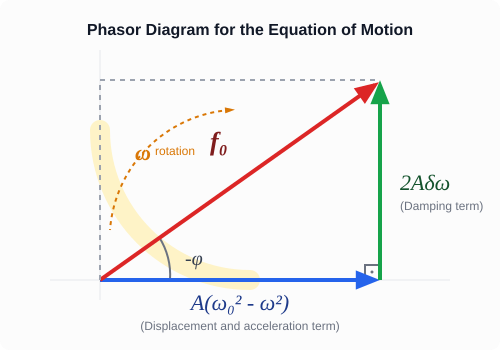

# Resonance *

## Experiment

[Demonstration of Forced Oscillation and Resonance by Elemér Sas](https://www.youtube.com/watch?v=NeCHP4AjgGg&t=121s)

In the video demonstration, a mechanical system consisting of a yellow sphere held between two stretched springs is used to study oscillations [0:01:17, 0:02:10]. When initially pushed, the system oscillates freely at its own natural frequency [0:02:23]. To demonstrate forced oscillations, the system is connected to an electric motor whose rotational speed can be varied [0:02:31]. The motor applies a periodic driving force to the assembly [0:02:43]. When the motor starts running, it induces a forced oscillation that occurs at the frequency of the driving source [0:02:53, 0:03:08]. When the driving frequency is close to—but not exactly equal to—the natural frequency, a phenomenon known as beats occurs, causing the displacement amplitude to fluctuate as the driving and natural oscillations alternately reinforce and cancel each other out [0:03:17, 0:03:31]. As the motor speed is adjusted closer to the system's natural frequency, the amplitude increases dramatically [0:03:41]. This state of maximum amplitude, where the driving frequency matches the natural frequency, is called resonance [0:03:52]. If left unmanaged at this frequency, it can lead to a resonance catastrophe, causing components of the system to break or tear apart [0:04:01]. Increasing the motor speed beyond this limit transitions the system back into a lower-amplitude forced oscillation state [0:04:10, 0:04:19].

## Simulation

In this simulation, we can repeat what was seen in the experiment. A periodic driving force acts on the body, which is symbolized by a red arrow in the simulation. This imparts energy to the system in exactly the same way as the periodic movement of the end of the spring did in the experiment. The latter moves the equilibrium position of the system periodically, which represents a periodic driving force that acts on the body. Provided that the natural frequency matches the frequency of the driving force, the energy of the system begins to increase, because the force acts at the correct cadence and its work is never negative, therefore it increases the mechanical energy of the system. This continues exactly until the damping dissipates just as much energy during one period as the system receives from the driving source. In this case, an oscillation with an amplitude that is constant over time develops, and this amplitude will be the largest when the natural frequency matches the frequency of the driving force. This is strictly true only in the undamped limiting case. If the damping is small but not negligible, the maximum amplitude occurs a little bit below the natural frequency of the system, as we will see. The driving frequency can be adjusted on a slider; the natural frequency of the system is in the middle.

[Forced Oscillation and Resonance Simulation](https://alexerdei73.github.io/physics-engine/project/#05652dfe-092a-4fe2-a4bc-f7a29109e103)

## Concepts

>**Free oscillation:** The oscillating body receives no energy from its environment but continuously loses it through damping. Due to damping, free oscillation dies out over time.

>**Natural frequency:** The frequency of undamped free oscillation. If the damping coefficient is small compared to the natural frequency, then the frequency of the damped free oscillation also matches the natural frequency.

>**Driving force:** A periodic force acting on the oscillating body or system, which can transfer energy to the body.

>**Forced oscillation:** A state of constant mechanical energy over time that develops under the influence of a periodic driving force acting on the system. The development of this takes time, the free oscillation dies out, and the frequency matches the frequency of the driving force. The amplitude is constant over time.

>**Resonance:** The amplitude of forced oscillation can become very large when the natural frequency and the frequency of the driving force match. This is resonance. The energy absorption by the oscillating system is maximal at resonance. The value of the amplitude will be maximal at a slightly lower frequency, when the damping losses are smaller.

## The Equation of Motion

In addition to the elastic force and damping, the periodic driving force is added to the forces if we want to examine the forced oscillation.

$$
F_{x,net} = -Dx - \beta v_x + F_0 \cos(\omega t)
$$

Based on Newton's second law, we can set the net force equal to the product of mass and acceleration.

$$
F_{x,net} = ma_x
$$

Thus, we can write the equation of motion, which we also rearrange.

$$
ma_x = -Dx -\beta v_x + F_0\cos(\omega t)
$$

$$
ma_x + \beta v_x + Dx = F_0\cos(\omega t)
$$

We can divide the equation by the mass, and thus we get the following form.

$$
a_x + 2\delta v_x + \omega_0^2 x = f_0\cos(\omega t)
$$

Here, we introduced the following notations.

$$
\delta = \frac \beta {2m}
$$

$$
\omega_0^2 = \frac D m
$$

$$
f_0 = \frac {F_0} m
$$

## The Phase Shift

Now we are going to find the formulas describing the frequency dependence of the amplitude and initial phase of the driven oscillation! All we know is that the frequency of the driven oscillation matches the frequency of the driving force and the amplitude is constant over time.

$$
x = A\cos(\omega t + \phi)
$$

We also know the formulas describing velocity and acceleration!

$$
v_x = -A\omega \sin(\omega t + \phi)
$$

$$
a_x = -A\omega^2 \cos(\omega t + \phi)
$$

We will substitute these into the equation of motion, then we use two identities well-known from trigonometry.

### The Addition Theorems of Trigonometry

$$
\sin (\alpha + \beta) = \sin \alpha \cos \beta + \cos \alpha \sin \beta
$$

$$
\cos (\alpha + \beta) = \cos \alpha \cos \beta - \sin \alpha \sin \beta
$$

We use these now for the substitution, so that we can write the expressions above as the sum of terms containing $\sin (\omega t)$ and $\cos (\omega t)$.

$$
x = A(\cos (\omega t) \cos \phi - \sin (\omega t) \sin \phi) = A\cos \phi \cos(\omega t) - A \sin \phi \sin (\omega t)
$$

$$
v_x = -A\omega(\sin(\omega t) \cos \phi + \cos(\omega t) \sin \phi) = -A\omega \cos \phi \sin(\omega t) - A\omega \sin \phi \cos(\omega t)
$$

$$
a_x = -A\omega^2(\cos(\omega t) \cos \phi - \sin (\omega t) \sin \phi) = -A\omega^2\cos\phi \cos(\omega t) + A\omega^2\sin\phi \sin(\omega t)
$$

Let us look first at the coefficients of $\sin(\omega t)$, which must yield 0, since no such term appears on the right side of the equation.

$$
A\omega^2\sin\phi + 2\delta(-A\omega\cos\phi) + \omega_0^2(-A\sin\phi) = 0
$$

$$
-2\delta\omega\cos\phi = (\omega_0^2 - \omega^2)\sin\phi
$$

$$
\tan \phi = - \frac {2\delta\omega} {\omega_0^2 - \omega^2}
$$

## The Amplitude

Now we are going to examine how the amplitude depends on the driving frequency. For this, we collect the terms containing $\cos(\omega t)$ on the left side of the equation of motion and we must get $f_0$, since $f_0\cos(\omega t)$ appears on the right side.

$$
-A\omega^2\cos\phi + 2\delta(-A\omega\sin\phi) + \omega_0^2A\cos\phi = f_0
$$

$$
A(-2\delta\omega\sin\phi + (\omega_0^2 - \omega^2)\cos\phi) = f_0
$$

The equation formed from the coefficients of $\sin(\omega t)$ can also be written in the following form.

$$
A(2\delta\omega\cos\phi + (\omega_0^2 - \omega^2)\sin\phi) = 0
$$

The trick is that we square both equations and add them together, thereby the phase shift drops out.

$$
A^2(4\delta^2\omega^2\sin^2\phi - 4\delta\omega(\omega_0^2 - \omega^2)\cos\phi\sin\phi + (\omega_0^2 - \omega^2)^2\cos^2\phi) + A^2(4\delta^2\omega^2\cos^2\phi + 4\delta\omega(\omega_0^2 - \omega^2)\cos\phi\sin\phi + (\omega_0^2 - \omega^2)^2\sin^2\phi) = f_0^2
$$

Performing the combinations, utilizing the trigonometric form of the Pythagorean theorem, we obtain the following equation.

$$
A^2((\omega_0^2 - \omega^2)^2 + 4\delta^2\omega^2) = f_0^2
$$

From here, $A$ can be expressed.

$$
A = \frac {f_0} {\sqrt {(\omega_0^2 - \omega^2)^2 + 4\delta^2\omega^2}}
$$

### The Method of Rotating Vectors (Phasors)

Let us recall how we introduced simple harmonic motion at the beginning of our studies! We imagined the oscillation as the shadow, the projection, of a body performing uniform circular motion (a moving point on the so-called reference circle). The angular velocity of this circular motion is precisely the angular frequency $\omega$.

We apply exactly this logic here too! During the forced oscillation, the displacement, the velocity, and the acceleration also vary periodically. We can imagine these quantities as vectors rotating with an angular velocity $\omega$, whose projection taken onto the horizontal axis gives the instantaneous values:

* The **displacement** stands at a certain angle.
* The **velocity** leads exactly by $90^\circ$ compared to the displacement (since cosine became sine).
* The **acceleration** is turned by $180^\circ$ compared to the displacement (since cosine became minus cosine).

Since all the terms appearing in the equation (the restoring effect, the damping, the acceleration, and the driving force) **rotate with the same angular frequency $\omega$**, their relative angle to each other never changes. If we "rotate along with them in our minds", then these vectors stand still, and they form a simple, stationary right-angled triangle!

* On the horizontal axis, the resultant of the terms in phase with and opposite phase to the displacement (the restoring effect and the acceleration term) can be found: $A(\omega_0^2 - \omega^2)$.
* On the vertical axis, perpendicular to these, stands the damping term coming from the velocity: $A(2\delta\omega)$.
* The vector sum of the two (the hypotenuse) must yield the driving excitation: $f_0$.

Thus, instead of complicated trigonometric identities, we can obtain the relationship between the amplitudes with a simple Pythagorean theorem!

### Examples
1. First, let us examine the ideal case without damping. Let us choose the amplitude of the driving force such that $f_0 = 1$ holds true.
Let $\omega_0 = 10$ rad/s, just like it is in the simulation! Let us plot the function!

$$
A = \frac 1 {\sqrt {(100 - \omega^2)^2}}
$$

The curve extends to infinity in the case of $\omega = \omega_0$, since nothing limits the growth of the amplitude. In practice, this leads to a *resonance catastrophe*.

2. Let us examine the case of the damping $\delta = 0.05$ featured in the simulation!

$$
A = \frac 1 {\sqrt {(100 - \omega^2)^2 + 0.01\omega^2}}
$$

It can be beautifully seen from the following GeoGebra project that the maximum is at $A = 1$. This would be the case for $f_0 = 1$, however, in our case $f_0 = 2$, and indeed at resonance the developing amplitude is approximately 2 m.

[Amplitude-Angular Frequency Graph](https://www.geogebra.org/calculator/hqz8kewk)

## The Amplitude Maximum

Now we are going to show that the amplitude is maximal at the following angular frequency.

$$
\omega_r = \sqrt {\omega_0^2 - 2\delta^2}
$$

The amplitude is maximal where the expression under the square root is minimal. Let us examine this expression!

$$
(\omega_0^2 - \omega^2)^2 + 4\delta^2\omega^2 = \omega^4 - 2\omega_0^2\omega^2 + \omega_0^4 + 4\delta^2\omega^2 = (\omega^2)^2 - 2(\omega_0^2 - 2\delta^2)\omega^2 + \omega_0^4
$$

Here we are dealing with a quadratic expression with respect to $\omega^2$. We can easily find its minimum by completing the square! First of all, let us notice that precisely $\omega_r^2$ stands in the parentheses in the second term!

$$
(\omega^2)^2 - 2\omega_r^2\omega^2 + \omega_0^4 = (\omega^2 - \omega_r^2)^2 + \omega_0^4 - \omega_r^4
$$

The minimum of this is when the first squared term is precisely 0, since the other two terms are constant!

$$
\omega = \omega_r
$$

With this, we have proven that the amplitude is maximal at the angular frequency $\omega_r$.

### Example
Let us calculate the angular frequency corresponding to the amplitude maximum and also the exact amplitude maximum in the case of our simulation example!

$$
\omega_0^2 = 100\text{ 1/s}^2
$$

$$
\delta = 0.05\text{ 1/s}
$$

$$
f_0 = 2\text{ N/kg}
$$

From these data, the position of the amplitude maximum is:

$$
\omega_r = \sqrt{\omega_0^2 - 2\delta^2} = \sqrt{100 - 2\cdot0.05^2} = 9.99975\text{ rad/s}
$$

Because of the small damping, this is only to a very small extent less than $\omega_0$. The amplitude maximum is:

$$
A_{max} = \frac {f_0} {\sqrt{\omega_0^2 - \omega_r^2)^2 + 4\delta^2\omega_r^2}} = \frac 2 {\sqrt{(100 - 9.99975^2)^2 + 4\cdot0.05^2\cdot9.99975^2}} = 2.0000\text{ m}
$$

## Problems

1. A body of mass $m = 0.5 \text{ kg}$ is suspended from a spring with a spring constant of $D = 50 \text{ N/m}$. The system is driven by a periodic force. The damping coefficient is $\beta = 0.2 \text{ kg/s}$. Determine the undamped natural angular frequency ($\omega_0$) of the system, as well as the driving angular frequency ($\omega_r$) at which the amplitude of the forced oscillation will be maximal!

2. The mass of a vehicle equipped with a shock absorber is $1200 \text{ kg}$, the net spring constant of the suspension system is $D = 3 \cdot 10^5 \text{ N/m}$. The vehicle travels on a road where transverse road defects (bumps) follow each other at equal distances of $L = 6 \text{ m}$. At what velocity ($v$) must the car travel for the phenomenon of resonance to occur, if the amount of shock damping is considered negligible?

3. Based on the expression for $\tan \phi$ derived in the theoretical summary, show how large the phase difference $\phi$ between the driving force and the displacement is in the special case when the driving frequency matches the natural frequency precisely ($\omega = \omega_0$)! Formulate in words as well what this phase difference means regarding the directions of velocity and the driving force!
