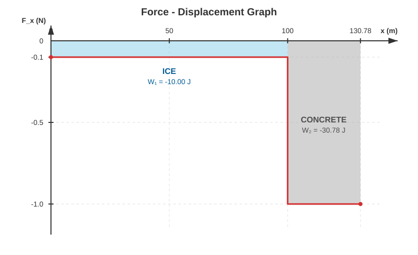
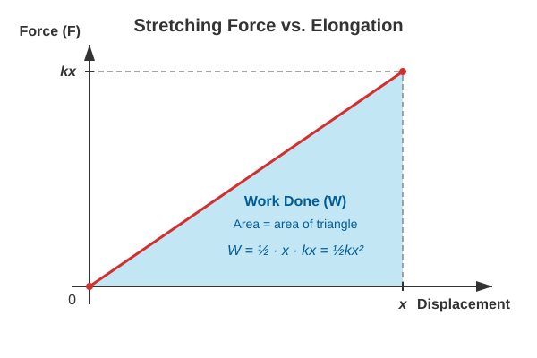

# Elastic Energy

## Work Done by a Variable Force

### Example
A hockey puck with a mass of $203.9\text{ g}$ slides on ice. The initial velocity of the puck is $20\text{ m/s}$. The coefficient of kinetic friction between the ice and the puck is $0.05$. After traveling its first $100\text{ m}$, the puck slides off the rink and continues onto concrete, where the coefficient of friction is $0.5$.
* What force slows down the puck on the ice?
* To what velocity does the puck slow down by the time it reaches the concrete?
* What force slows down the puck on the concrete?
* What distance does the puck travel on the concrete before stopping?
* What is the work done by the friction force on the ice?
* What is the work done by the friction force on the concrete?
* Plot the friction force as a function of the distance traveled! What is the area under the curve of the graph?

Let the puck move along the positive x-axis. This allows us to work directly with the x-components.

$$
F_{x,1} = -\mu_1 mg = -0.05 \cdot 0.2039 \cdot 9.81 = -0.1000\text{ N}
$$

$$
a_{x,1} = \frac {F_{x,1}} {m} = \frac {-0.1000} {0.2039} = -0.4905\text{ m/s}^2
$$

$$
s_1 = v_{x,0}t + \frac {a_{x,1}} {2}t^2
$$

$$
100 = 20t + \frac {-0.4905} {2}t^2
$$

$$
0.4905t^2 - 40t + 200 = 0
$$

$$
t = \frac {-b \pm \sqrt{b^2 - 4ac}} {2a} = \frac {40 \pm \sqrt{40^2 - 4 \cdot 0.4905 \cdot 200}} {2 \cdot 0.4905} = \frac {40 \pm 34.75} {0.981} = 5.351\text{ s}, \quad 76.19\text{ s}
$$

Of the two solutions to the quadratic equation, the shorter time is physically correct (the longer time would mean the object turns around after stopping and starts moving backward, which does not happen due to friction). Therefore, the time is $5.351\text{ s}$.

$$
v_x = v_{x,0} + a_{x,1}t = 20 + (-0.4905) \cdot 5.351 = 17.38\text{ m/s} \quad \text{(more precisely: } 17.375\text{ m/s)}
$$

To avoid accumulating rounding errors, we use the precise value of $17.375\text{ m/s}$ for further calculations.

$$
F_{x,2} = -\mu_2 mg = -0.5 \cdot 0.2039 \cdot 9.81 = -1.0001\text{ N}
$$

$$
a_{x,2} = \frac {F_{x,2}} {m} = \frac {-1.0001} {0.2039} = -4.905\text{ m/s}^2
$$

Calculating the acceleration component:

$$
a_{x,2} = \frac {\Delta v_x} {t_2}
$$

This can be rearranged to solve for the unknown time interval:

$$
t_2 = \frac {\Delta v_x} {a_{x,2}} = \frac {0 - 17.375} {-4.905} = 3.542\text{ s}
$$

Since $v_x$ represents the initial velocity of the puck as it starts braking on the concrete, the distance is given by the following formula:

$$
s_2 = v_x t_2 + \frac {a_{x,2}} {2}t_2^2 = 17.375 \cdot 3.542 + \frac{-4.905}{2} \cdot 3.542^2 = 30.77\text{ m}
$$

Now it is easy to calculate the work components!

$$
W_1 = F_{x,1} s_1 = -0.1000 \cdot 100 = -10.00\text{ J}
$$

$$
W_2 = F_{x,2} s_2 = -1.0001 \cdot 30.77 = -30.78\text{ J}
$$

The total work, which must equal the change in kinetic energy, is:

$$
W = W_1 + W_2 = -10.00 - 30.78 = -40.78\text{ J}
$$

Indeed, the change in kinetic energy is:

$$
\Delta E_{\text{k}} = E_{\text{k,final}} - E_{\text{k,initial}} = 0 - \frac {m v_0^2} {2} = -\frac {0.2039 \cdot 20^2} {2} = -40.78\text{ J}
$$

The two results are in perfect agreement.

The figure shows that for a variable force that is piecewise constant, the work done corresponds to the area under the force-displacement graph. In our example, the friction force is negative because it acts against the motion, meaning it points in the opposite direction of the displacement. In this case, the area has a negative sign, and the force line runs below the displacement axis.

This statement holds true generally for any variable force.

> **The work done is nothing other than the (signed) area under the force-displacement graph.**

## Work Done When Stretching a Spring

Let the spring initially be unstretched, and then let us stretch it slowly and without acceleration so that its final elongation becomes $x$. How much work must we perform to achieve this? At the beginning of the elongation, the force is nearly zero, since the spring does not exert a force yet. At the end of the process, a force of $Dx$ must be applied to keep the spring stretched. The force increases in direct proportion to the displacement. Let us plot the stretching force as a function of the displacement! We obtain the following graph:

The graph shows that the work required to stretch the spring corresponds to the area of a right-angled triangle:

$$
W = \frac {F(x)x} {2} = \frac{(Dx)x} {2} = \frac {Dx^2} {2}
$$

## Elastic Energy

The work required to stretch a spring increases its elastic potential energy. The elastic force is also a conservative force, meaning the work done by the spring decreases its elastic energy. The calculation for elastic energy is therefore:

$$
E_{\text{e}} = \frac {Dx^2} {2}
$$

Elastic energy is a form of potential energy, just like gravitational potential energy.

### Example
A spring with a spring constant of $200\text{ N/m}$ is stretched by $0.2\text{ m}$.
* How much force is needed to keep the spring stretched?
* How much work did we do, and what is the elastic energy? 
* In a lossless catapult, to what velocity can this spring accelerate a ball with a mass of $10\text{ g}$, assuming losses can be neglected?
* The catapult shoots the ball vertically upward. How high will it rise? Air resistance is neglected.

$$
F = -F_{\text{s}} = Dx = 200 \cdot 0.2 = 40\text{ N}
$$

$$
W = E_{\text{e}} = \frac {Dx^2} {2} = \frac {200 \cdot 0.2^2} {2} = 4\text{ J}
$$

$$
E_{\text{e}} = E_{\text{k}} = \frac {mv^2} {2}
$$

$$
v = \sqrt {\frac {2E_{\text{e}}} {m}} = \sqrt {\frac{8}{0.01}} = 28.28\text{ m/s}
$$

$$
E_{\text{p}} = E_{\text{k}} = mgh
$$

$$
h = \frac {E_{\text{k}}} {mg} = \frac {4} {0.01 \cdot 9.81} = 40.77\text{ m}
$$

### Simulation

[The Catapult Example](https://alexerdei73.github.io/physics-engine/project/#804a06d3-a20a-401b-94c2-b5989a56c61c)

Let us check the maximum height reached by the ball in the simulator!

---

## Problems

**Problem 1**
A box with a mass of $500\text{ g}$ is pushed across the floor with an initial velocity of $5\text{ m/s}$. The coefficient of kinetic friction between the box and the floor is $\mu = 0.2$.  
*What distance does the box travel before stopping, and what is the work done by the friction force? Verify your result using the work-energy theorem!*

**Problem 2**
A toy car ($m = 150\text{ g}$) collides with a horizontal spring that has a spring constant of $D = 120\text{ N/m}$. The velocity of the car at the moment of impact is $2\text{ m/s}$.  
*What will the maximum compression of the spring be if friction is completely neglected?*

**Problem 3**
The spring of a spring-loaded launcher ($D = 500\text{ N/m}$) is compressed by $10\text{ cm}$, and a $50\text{ g}$ ball is launched across a horizontal table. The coefficient of friction on the table surface is $0.15$.  
*How far does the ball travel from the launch point (measured from the equilibrium position of the spring) before it comes to a complete stop due to friction?*
