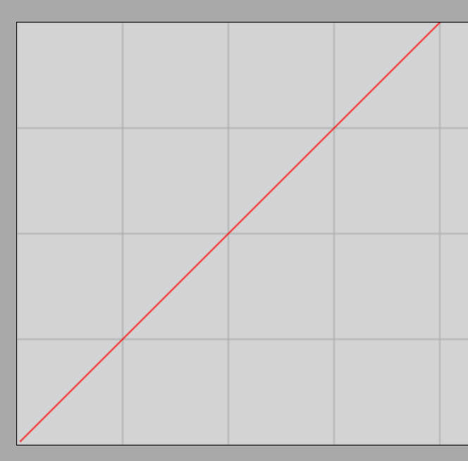

# Velocity

## The Concept of Rectilinear Uniform Motion

When an object moves along a straight path with a constant magnitude and direction of velocity, we speak of **rectilinear uniform motion**.

*Example:* A car travels uniformly at a speed of $60\text{ km/h}$. What does this mean in practice?
A speed of $60\text{ km/h}$ means that the car covers a distance of $60\text{ km}$ per hour. Since one hour consists of $60$ minutes, the car moves forward by exactly $1\text{ km}$ per minute.

During uniform motion, the object covers equal distances in equal time intervals. We can also say that there is a direct proportionality between the distance traveled and the elapsed time.

> **In the case of rectilinear uniform motion, the object moves along a straight path such that it always covers equal distances in arbitrarily chosen, equal time intervals.**

### Demonstration
[Demonstration of uniform and uniformly accelerated motion using an air track](https://www.youtube.com/watch?v=PCLjIjAUBnw&t)

### Simulation
[Rectilinear Uniform Motion Simulator](https://alexerdei73.github.io/physics-engine/project/#c1c7278a-8c14-4386-ad82-477930ee81d2)

With the help of the simulation, we can also graphically plot the distance traveled by the object as a function of time. To do this, check the **Graphs** checkbox, then open the **Results** panel. Select the **Path Length** (distance traveled) field, then return to the main screen using the **Switch back** button and start the animation. A graph similar to the one below will then be drawn:

The vertical axis of the graph shows the distance traveled, and the horizontal axis shows the elapsed time. The grid represents the unit resolution on both axes. Based on the graph, it can be seen that at the beginning of the motion ($t = 0\text{ s}$), the distance traveled is also zero, meaning that the line starts from the origin. After $1\text{ s}$, the distance is $1\text{ m}$, after $2\text{ s}$ it is $2\text{ m}$, and so on. From this, it follows that the velocity of the object under investigation is exactly $1\text{ }\frac{\text{m}}{\text{s}}$.

## The Concept and Formula of Velocity

Velocity represents the distance traveled per unit of time; its value is constant in the case of uniform motion. Velocity is actually a **vector quantity**: its direction coincides with the instantaneous direction of motion. In uniform motion, the magnitude of the velocity remains strictly constant, and in rectilinear motion, the direction of the velocity ($\vec{v}$) also remains strictly constant.

> **Velocity represents the quotient of the distance traveled and the time required to cover it in the case of uniform motion. Symbol: $v$, fundamental SI unit: $\text{m/s}$.**

$$
v = \frac{s}{t}
$$

In this formula, $s$ denotes the distance traveled, and $t$ denotes the corresponding time duration.

### Examples

1. A car travels uniformly, its speedometer shows $60\text{ km/h}$. What is this velocity in units of $\text{m/s}$? What distance does the car cover in $20\text{ s}$? How much time does it take to cover $100\text{ m}$?

Velocity conversion:

$$
v = \frac{s}{t} = \frac{60\text{ km}}{1\text{ h}} = \frac{60\ 000\text{ m}}{3600\text{ s}} \approx 16.7\text{ }\frac{\text{m}}{\text{s}}
$$

*(Since the initial data was given to two significant figures, we can retain three significant figures in the intermediate calculation, but we must pay attention to precision in the final practical answers.)*

Let us find the distance traveled in $20\text{ s}$ (let this be the unknown $x$):

$$
16.7\text{ }\frac{\text{m}}{\text{s}} = \frac{x}{20\text{ s}}
$$

Multiplying both sides of the equation by $20\text{ s}$, we obtain:

$$
x = 16.7\text{ }\frac{\text{m}}{\text{s}} \cdot 20\text{ s} = 334\text{ m}
$$

Based on the precision of the initial data, the last digit is already uncertain, so in reality, the car covers **approximately $330\text{ m}$** when rounded.

Let us find the time required to cover $100\text{ m}$, where the unknown is also denoted by $x$:

$$
16.7\text{ }\frac{\text{m}}{\text{s}} = \frac{100\text{ m}}{x}
$$

To simplify the calculation, we can omit the units during rearrangement, since the time will automatically be obtained in seconds:

$$
16.7 \cdot x = 100
$$

$$
x = \frac{100}{16.7} \approx 6.0\text{ s}
$$

Thus, the car covers the $100\text{ m}$ distance in exactly **$6\text{ s}$**.

2. A car travels uniformly at a speed of $30\text{ }\frac{\text{m}}{\text{s}}$. What distance does it cover in $3600\text{ s}$ (meaning one hour)? What is its speed in $\text{km/h}$? How much time does it take to reach a city located at a distance of $150\text{ km}$?

Let us calculate the distance traveled in one hour ($x$):

$$
30 = \frac{x}{3600}
$$

$$
x = 30 \cdot 3600 = 108\ 000\text{ m} = 108\text{ km}
$$

Since the car covers $108\text{ km}$ in a single hour, its velocity can be directly written in the form of **$108\text{ km/h}$**.

Now let us determine the time required for the $150\text{ km}$ distance ($x$), already using the calculated $\text{km/h}$ unit:

$$
108 = \frac{150}{x}
$$

$$
108 \cdot x = 150
$$

$$
x = \frac{150}{108} \approx 1.39\text{ h}
$$

Since $0.39\text{ h} = 0.39 \cdot 60\text{ min} \approx 23\text{ min}$, the travel time is **$1\text{ hour } 23\text{ minutes}$**.

## Exercises

1. A train travels uniformly at a speed of $80\text{ km/h}$. What is this speed in units of $\text{m/s}$? What distance does the train cover in $45\text{ s}$?
2. A cyclist travels at a speed of $5\text{ m/s}$. What distance do they cover in $2\text{ min}$? How much time does it take to cover a distance of $15\text{ km}$?
3. A runner runs at a speed of $6\text{ m/s}$. What is this speed in units of $\text{km/h}$? How much time does it take to run a $100\text{ m}$ segment?
4. A car travels at a speed of $25\text{ m/s}$. What distance does it cover in $1\text{ hour}$? What is its speed in $\text{km/h}$?
5. An autonomous vehicle moves at a speed of $72\text{ km/h}$. What is this speed in units of $\text{m/s}$? How much time does it take to cover $500\text{ m}$?
6. A Roman snail travels at a speed of $0.01\text{ m/s}$. What distance does it cover in $10\text{ min}$? How much time does it take to cover exactly $1\text{ meter}$?
7. An airplane flies at a speed of $900\text{ km/h}$. What is this speed in units of $\text{m/s}$? What is the distance between two cities if the airplane takes $2\text{ hours}$ to get from one to the other?
8. An interplanetary space probe travels at a speed of $50,000\text{ km/h}$. What is this speed in units of $\text{m/s}$? What distance does it cover during a full day ($24\text{ hours}$)?
9. A motorcyclist travels at a speed of $15\text{ m/s}$. What is this speed in units of $\text{km/h}$? What distance do they cover in $30\text{ min}$?
10. The distance between two cities is $240\text{ km}$. One car travels at a constant speed of $80\text{ km/h}$, and another at $100\text{ km/h}$. What is the difference in travel times? How many minutes later does the first car arrive compared to the second?
