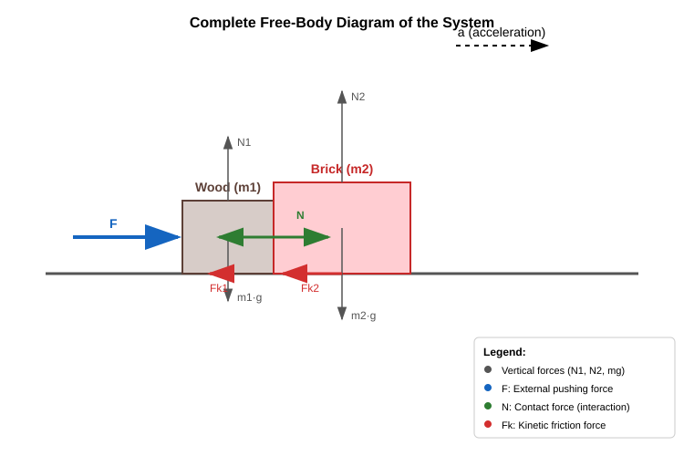

# The Center of Mass Theorem

## General Derivation of the Impulse Theorem

We will now examine the general derivation of the impulse (momentum) theorem, as we have previously proven this theorem only for a system of 2 bodies. Let us now consider a system of $N$ point masses. For the $i$-th body, Newton's second law is stated as:

$$
\vec{F}_{\text{net},i} = \frac{\Delta \vec{p}_i}{t}
$$

Let us rewrite this slightly to make our work easier:

$$
\vec{F}_{\text{net},i}^{\text{ext}} + \sum_{j = 1, j \neq i}^{N} \vec{F}_{i,j} = \frac{m_i \vec{v}_i - m_i \vec{v}_{i,0}}{t}
$$

Now, we sum these equations over all point masses:

$$
\sum_{i = 1}^{N} \vec{F}_{\text{net},i}^{\text{ext}} + \sum_{i = 1}^{N} \sum_{j = 1, j \neq i}^{N} \vec{F}_{i,j} = \sum_{i = 1}^{N} \frac{m_i \vec{v}_i - m_i \vec{v}_{i,0}}{t}
$$

Next, we will show that the sum of all internal forces is zero.

$$
\sum_{i = 1}^{N} \sum_{j = 1, j \neq i}^{N} \vec{F}_{i,j} = \sum_{i = 1}^{N} \sum_{j = 1}^{i - 1} \vec{F}_{i,j} + \sum_{i = 1}^{N} \sum_{j = i + 1}^{N} \vec{F}_{i,j}
$$

We split the original double sum into two distinct sums. In the first sum, $j < i$, while in the second sum, $j > i$. Both sums combined contain all possible pairings under these constraints. If we now swap the indices $i$ and $j$ in $\vec{F}_{i,j}$ within the second sum, and simultaneously transition to the limits of the first sum (meaning $j < i$ instead of $j > i$), the value of the sum remains unchanged. For example, if originally $i = 2$ and $j = 3$, this pair appears in the second sum because $j > i$, representing $\vec{F}_{2,3}$. If we now let the indices $i = 3$ and $j = 2$ describe this very same term, meaning $j < i$, it becomes $\vec{F}_{j,i}$. Performing this index swap for all terms in the second sum does not change the total value of the sum.

$$
\sum_{i = 1}^{N} \sum_{j = i + 1}^{N} \vec{F}_{i,j} = \sum_{i = 1}^{N} \sum_{j = 1}^{i - 1} \vec{F}_{j,i}
$$

Thus, the total sum of internal forces is:

$$
\sum_{i = 1}^{N} \sum_{j = 1, j \neq i}^{N} \vec{F}_{i,j} = \sum_{i = 1}^{N} \sum_{j = 1}^{i - 1} \vec{F}_{i,j} + \sum_{i = 1}^{N} \sum_{j = 1}^{i - 1} \vec{F}_{j,i} = \sum_{i = 1}^{N} \sum_{j = 1}^{i - 1} (\vec{F}_{i,j} + \vec{F}_{j,i}) = \vec{0}
$$

Here we applied Newton's third law:

$$
\vec{F}_{i,j} = -\vec{F}_{j,i}
$$

According to this law, the individual paired terms in the sum are all zero. Now, let us manipulate the right side of the main equation as well:

$$
\sum_{i = 1}^{N} \frac{m_i \vec{v}_i - m_i \vec{v}_{i,0}}{t} = \frac{\sum_{i = 1}^{N} m_i \vec{v}_i - \sum_{i = 1}^{N} m_i \vec{v}_{i,0}}{t} = \frac{\vec{p} - \vec{p}_0}{t}
$$

Our final result is the impulse theorem:

$$
\sum_{i = 1}^{N} \vec{F}_{\text{net},i}^{\text{ext}} = \frac{\vec{p} - \vec{p}_0}{t}
$$

> **The vector sum of external forces acting on a system of particles equals the rate of change of the system's total momentum per unit time.**

## The Center of Mass Theorem

Now we apply what we know about the total momentum of a system of particles. It can be expressed using the velocity of the center of mass, since:

$$
\vec{v}_{\text{CM}} = \frac{\sum_{i = 1}^{N} m_i \vec{v}_i}{M}
$$

$$
M \vec{v}_{\text{CM}} = \sum_{i = 1}^{N} m_i \vec{v}_i = \sum_{i = 1}^{N} \vec{p}_i = \vec{p}
$$

$$
\sum_{i = 1}^{N} \vec{F}_{\text{net},i}^{\text{ext}} = \frac{M \vec{v}_{\text{CM}} - M \vec{v}_{\text{CM},0}}{t}
$$

Factoring out the total mass $M$ from the right side:

$$
\frac{M \vec{v}_{\text{CM}} - M \vec{v}_{\text{CM},0}}{t} = M \frac{\vec{v}_{\text{CM}} - \vec{v}_{\text{CM},0}}{t} = M \vec{a}_{\text{CM}}
$$

Here, we have introduced the acceleration of the center of mass:

$$
\vec{a}_{\text{CM}} = \frac{\vec{v}_{\text{CM}} - \vec{v}_{\text{CM},0}}{t}
$$

This matches our previous definition of acceleration, with one important caveat. Up until now, we have mostly applied this relationship to straight-line motion where the acceleration vector is parallel to the velocity. If the direction of the velocity also changes, the relationship can only be applied to vectors or their respective components.

Our final result is the center of mass theorem:

$$
\sum_{i = 1}^{N} \vec{F}_{\text{net},i}^{\text{ext}} = M \vec{a}_{\text{CM}}
$$

This theorem is very similar to Newton's second law, but with two important distinctions:
1. Only external forces matter—forces exerted by objects that do not belong to the system.
2. The total mass of the system is used, and it describes the acceleration of the center of mass, a position where there often is no physical particle at all, making it purely a mathematical point.

> **The center of mass of a system moves like a single particle containing the total mass of the entire system, driven by a net force equal to the vector sum of all external forces acting on the system. This is the center of mass theorem.**

This theorem allows us to apply mechanics to large, extended macroscopic objects, provided that the laws of Newtonian mechanics hold true for the small particles that comprise them.

However, it does not conversely follow that just because Newtonian mechanics applies to macroscopic objects, it must apply equally to their tiny constituent point-like particles. Indeed, the 20th century revealed that the laws of Newtonian mechanics cannot be applied to atomic or subatomic particles. At such microscopic scales, quantum mechanics must be used instead. Quantum mechanics replicates Newton's laws for macroscopic bodies, but its rules for tiny individual particles differ significantly from Newton's laws.

We have already used this theorem countless times. In reality, what we model as point masses usually contain an enormous number of microscopic particles, but their internal structure is simply irrelevant to describing their overall motion. Because of the center of mass theorem, this motion can be accurately modeled using Newton's second law.

### Example

A wooden block and a brick move together across a horizontal tabletop. We push the wooden block with a horizontal force of $20.0\text{ N}$. The mass of the block is $500\text{ g}$. This block pushes a brick in front of it, which has a mass of $1.50\text{ kg}$. The coefficient of friction between the wooden block and the table is 0.3. The coefficient of friction between the brick and the table is 0.7. What is the net external force acting on the system? What is the acceleration? What is the internal force between the wooden block and the brick during this motion? If we let go of the wooden block, the system begins to slow down. What is the net external force now? What is the deceleration? What is the internal force now?

First, let us calculate the kinetic friction forces during the sliding motion:

$$
F_{\text{k},1} = \mu_1 N_1 = \mu_1 m_1 g = 0.3 \cdot 0.5 \cdot 9.81 \approx 1.472\text{ N}
$$

$$
F_{\text{k},2} = \mu_2 N_2 = \mu_2 m_2 g = 0.7 \cdot 1.50 \cdot 9.81 \approx 10.30\text{ N}
$$

Since we are pushing the blocks and friction opposes this movement, the magnitude of the net external force is:

$$
F_{\text{net}} = F - F_{\text{k},1} - F_{\text{k},2} = 20.0 - 1.472 - 10.30 = 8.228\text{ N}
$$

The acceleration, which is identical for both bodies and is equal to the acceleration of the center of mass, is:

$$
a = \frac{8.228}{2.00} = 4.114\text{ m/s}^2
$$

The brick is accelerated by the horizontal contact force (normal force) between the wooden block and the brick, while friction opposes its motion.

$$
F_{\text{net},2} = N - F_{\text{k},2} = m_2 a
$$

$$
N = m_2 a + F_{\text{k},2} = 1.50 \cdot 4.114 + 10.30 = 16.47\text{ N}
$$

After releasing the wooden block, the net external force changes:

$$
F_{\text{net}}^{\text{new}} = -F_{\text{k},1} - F_{\text{k},2} = -11.772\text{ N}
$$

The deceleration (new acceleration) is:

$$
a^{\text{new}} = \frac{F_{\text{net}}^{\text{new}}}{M} = \frac{-11.772}{2.00} = -5.886\text{ m/s}^2
$$

Now, the wooden block pushes the brick with a different force:

$$
N^{\text{new}} - F_{\text{k},2} = m_2 a^{\text{new}}
$$

$$
N^{\text{new}} = m_2 a^{\text{new}} + F_{\text{k},2} = 1.50 \cdot (-5.886) + 10.30 = 1.471\text{ N}
$$

This contact force can only take positive values because the brick is not glued to the wooden block. If the calculation were to yield a negative result, it would mean that the brick and the wooden block would decelerate at different rates upon release, meaning we could no longer state that they move together. That is not the case in our example.

## Exercises

1. A fireworks rocket is launched at an angle. At the highest point of its trajectory, the rocket explodes and shatters into several pieces. What can be said about the motion of the fragments' collective center of mass after the explosion, before any piece hits the ground, if air resistance is neglected?

2. A $60\text{ kg}$ person and a $40\text{ kg}$ child stand facing each other on ice (a frictionless surface). They grab onto each other and push each other away. What will be the acceleration of the system's center of mass during and after the push?

3. Two bodies ($m_1 = 2\text{ kg}$, $m_2 = 3\text{ kg}$) are connected by an inextensible string of negligible mass. The bodies are pulled across a horizontal, frictionless tabletop by a force of $F = 10\text{ N}$ acting on the body of mass $m_1$. Calculate the acceleration of the system's center of mass! Does the tension in the string, as an internal force, matter when determining the acceleration of the center of mass?